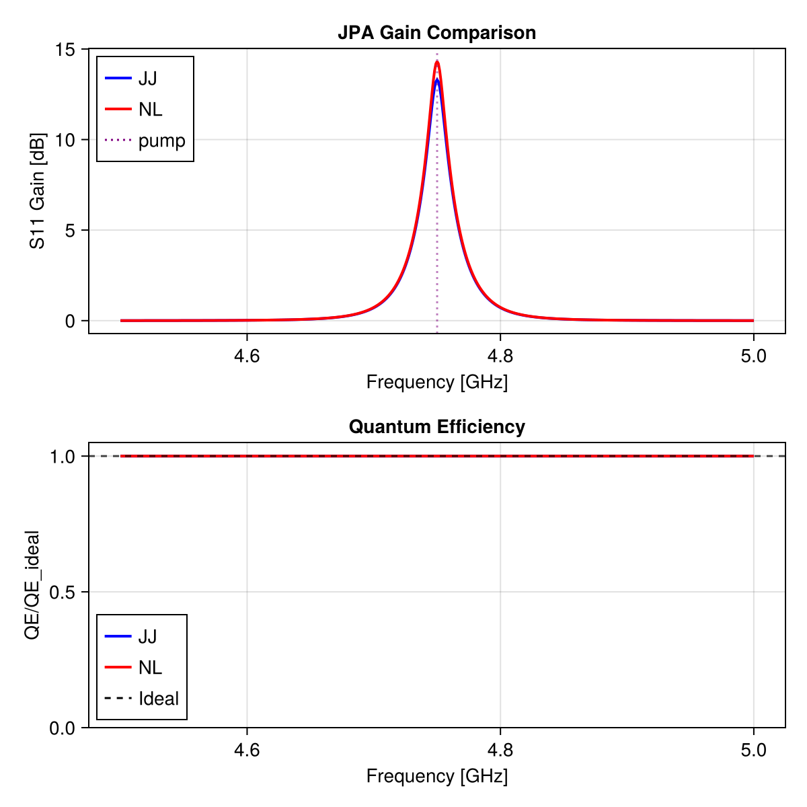
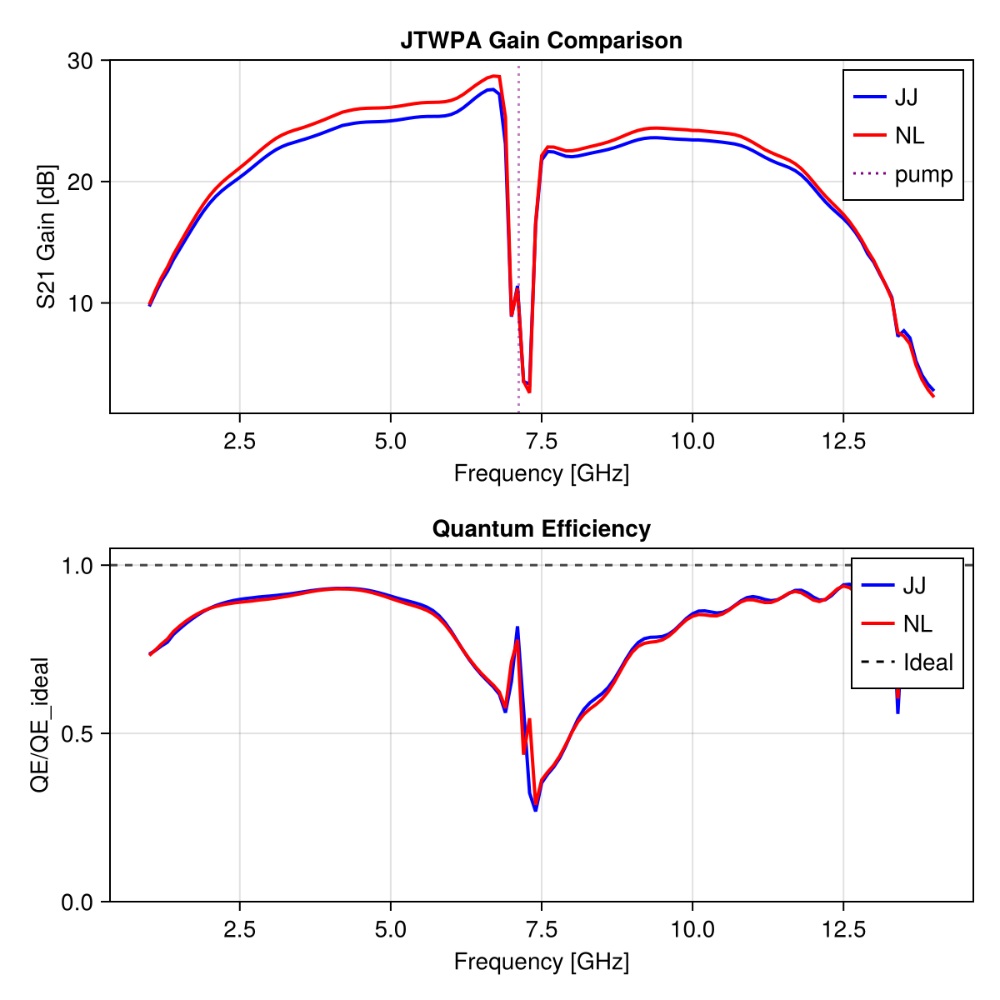
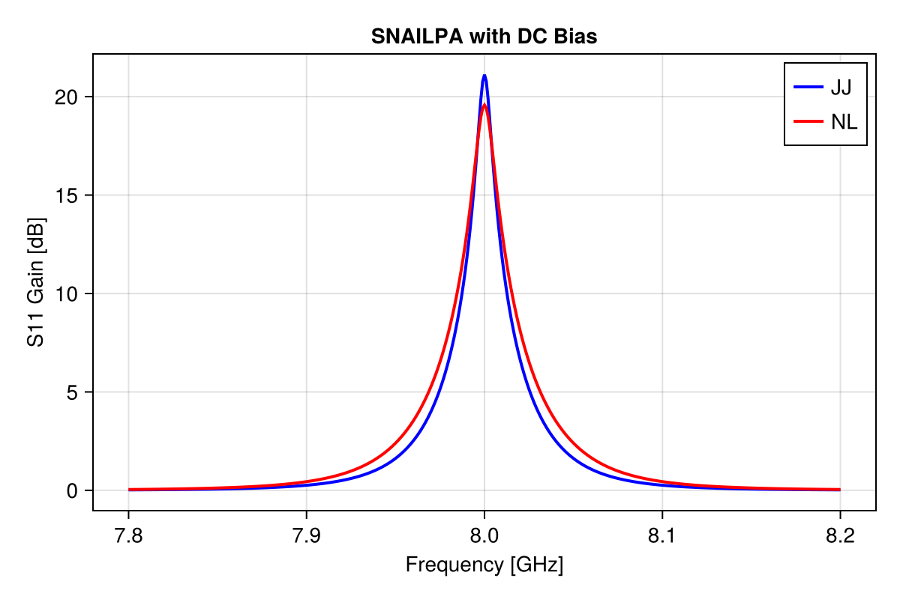

# JosephsonCircuits.jl

[](https://codecov.io/gh/kpobrien/JosephsonCircuits.jl)
[](https://github.com/kpobrien/JosephsonCircuits.jl/actions?query=workflow) [](https://juliaci.github.io/NanosoldierReports/pkgeval_badges/J/JosephsonCircuits.html) [](https://josephsoncircuits.org/stable)
 [](https://josephsoncircuits.org/dev)

[JosephsonCircuits.jl](https://github.com/kpobrien/JosephsonCircuits.jl) is a high-performance frequency domain simulator for nonlinear circuits containing Josephson junctions, capacitors, inductors, mutual inductors, and resistors. [JosephsonCircuits.jl](https://github.com/kpobrien/JosephsonCircuits.jl) simulates the frequency domain behavior using a variant [1] of nodal analysis [2] and the harmonic balance method [3-5] with an analytic Jacobian. Noise performance, quantified by quantum efficiency, is efficiently simulated through an adjoint method.

Frequency dependent circuit parameters are supported to model realistic impedance environments or dissipative components. Dissipation can be modeled by capacitors with an imaginary capacitance or frequency dependent resistors. 

[JosephsonCircuits.jl](https://github.com/kpobrien/JosephsonCircuits.jl) supports the following:
* Nonlinear simulations in which the user defines a circuit, the drive current, frequency, and number of harmonics and the code calculates the node flux or node voltage at each harmonic.
* Linearized simulations about the nonlinear operating point calculated above. This simulates the small signal response of a periodically time varying linear circuit and is useful for simulating parametric amplification and frequency conversion in the undepleted (strong) pump limit. Calculation of node fluxes (or node voltages) and scattering parameters of the linearized circuit [4-5].
* Linear simulations of linear circuits. Calculation of node fluxes (or node voltages) and scattering parameters.
* Calculation of symbolic capacitance and inverse inductance matrices.

As detailed in [6], we find excellent agreement with [Keysight ADS](https://www.keysight.com/us/en/products/software/pathwave-design-software/pathwave-advanced-design-system.html) simulations and Fourier analysis of time domain simulation performed by [WRSPICE](http://wrcad.com/wrspice.html).

**Warning:** this package is under heavy development and there will be breaking changes. We will keep the examples updated to ease the burden of any breaking changes.

# New Feature: Taylor Expansion Nonlinearities

JosephsonCircuits.jl now supports Taylor expansion nonlinearities (NL elements) in addition to Josephson junctions. This enables modeling of nonlinear inductors with polynomial current-flux relationships, useful for simulating DC-biased RF SQUID TWPAs, KTWPAs, and other nonlinear inductance-based devices.

## Mathematical Model

The NL element models nonlinear inductors of the form:
```
L(φ) = L₀(1 + c₁φ + c₂φ² + c₃φ³ + c₄φ⁴)
```

Where:
- `L₀` is the linear inductance
- `c₁, c₂, c₃, c₄` are the Taylor expansion coefficients  
- `φ` is the flux

## Current-Phase Relationship

The corresponding current-phase relation is derived from `φ₀ dφ/dt = L dI/dt` where `φ₀` is the reduced flux quantum:

```
I(φ) = φ₀/L₀ (φ - c₁φ²/2 + (c₁² - c₂)φ³/3 - (c₁³ - 2c₁c₂ + c₃)φ⁴/4 + (c₁⁴ - 3c₁²c₂ + c₂² + 2c₁c₃ - c₄)φ⁵/5)
```

## Technical Summary

- **Component Type**: New `NL` component type for nonlinear inductors
- **Syntax**: `("NL1", "node1", "node2", "poly L0[, c1][, c2][, c3][, c4]")`. Supports symbolic variables defined in `circuitdefs` dictionary
- **Example**: `("NL1", "1", "2", "poly 329e-12, 0.0, 0.5")` approximates a 329 pH Josephson junction
- **Integration**: Extends existing harmonic balance solver through unified FFT machinery
- **Mixed Circuits**: Supports circuits with both Josephson junctions and Taylor expansion elements

For detailed implementation details, see [docs/nl_implementation.md](docs/nl_implementation.md).

## Usage

### Basic NL Element Definition
```julia
# Define a circuit with Taylor expansion nonlinearity
circuit = [
    ("P1", "1", "0", "1"),
    ("R1", "1", "0", "50"),
    ("NL1", "1", "2", "poly 1e-9, 0.0, 0.5, 0.0, 0.1"),  # L0=1nH, c2=0.5, c4=0.1
    ("C1", "2", "0", "1e-15"),
    ("P2", "2", "0", "2"),
    ("R2", "2", "0", "50")
]
```

### Using Symbolic Variables
```julia
# Circuit with symbolic parameters
circuit = [
    ("NL1", "1", "2", "poly L0val, c1val, c2val, c3val, c4val")
]

# Define parameters in dictionary
circuitdefs = Dict(
    "L0val" => 1e-9,    # Base inductance
    "c1val" => 0.0,     # Linear term (usually 0)
    "c2val" => 0.5,     # Quadratic term
    "c3val" => 0.0,     # Cubic term
    "c4val" => 0.1      # Quartic term
)
```

### Approximating a Josephson Junction with Taylor Expansion
```julia
# Josephson junction circuit
jj_circuit = [("B1", "1", "0", "1e-6")]  # 1 μA critical current

# Equivalent Taylor approximation (sin(φ) ≈ φ - φ³/6)
# For a JJ: L_J = `\phi_0`/(2π*Ic) = 329 pH for Ic = 1 μA
nl_circuit = [("NL1", "1", "0", "poly 329e-12, 0.0, 0.5")]
```

# Acknowledgments

Original JosephsonCircuits.jl developed by [Kevin O'Brien](https://github.com/kpobrien). Taylor expansion nonlinearity feature contributed by [Maxime Malnou](https://github.com/MaxMalnou).

# Installation:

To install the latest release of the package, install Julia using [Juliaup](https://github.com/JuliaLang/juliaup), start Julia, and enter the following command:
```
using Pkg
Pkg.add("JosephsonCircuits")
```

To install the development version, start Julia and enter the command:
```
using Pkg
Pkg.add(name="JosephsonCircuits",rev="main")
```

To run the examples below, you will need to install Plots.jl using the command:
```
Pkg.add("Plots")
```

To run the Taylor expansion nonlinearity comparison examples, you will also need to install CairoMakie.jl:
```
Pkg.add("CairoMakie")
```

If you get errors when running the examples, please try installing the latest version of Julia and updating to the latest version of JosephsonCircuits.jl by running:
```
Pkg.update()
```

Then check that you are running the latest version of the package with:
```
Pkg.status()
```

Simulations of the linearized system can be effectively parallelized, so we suggest starting Julia with the number of threads equal to the number of physical cores. This can be done with the command line argument `--threads` or by setting the environmental variable `JULIA_NUM_THREADS`. See the [Julia documentation](https://docs.julialang.org/en/v1/manual/multi-threading) for the more details. Verify you are using the desired number of threads by running:
```
Threads.nthreads()
```
For context, the simulation times reported for the examples below use 16 threads on an AMD Ryzen 9 9950X system running Linux.

The examples can be run in the command line (REPL) after starting Julia or you can run them in a Jupyter notebook with [IJulia](https://github.com/JuliaLang/IJulia.jl) or in Visual Studio Code with the [Julia extension](https://code.visualstudio.com/docs/languages/julia).

# Usage:
Generate a netlist using circuit components including capacitors `C`, inductors `L`, Josephson junctions described by the Josephson inductance `Lj`, nonlinear inductors described by Taylor expansion coefficients `NL`, mutual inductors described by the mutual coupling coefficient `K`, and resistors `R`. See the [SPICE netlist format](https://duckduckgo.com/?q=spice+netlist+format), docstrings, and examples below for usage. Run the harmonic balance analysis using [`hbnlsolve`](https://josephsoncircuits.org/stable/reference/#JosephsonCircuits.hbnlsolve-Union{Tuple{K},%20Tuple{N},%20Tuple{NTuple{N,%20Number},%20Any,%20JosephsonCircuits.Frequencies{N},%20JosephsonCircuits.FourierIndices{N},%20JosephsonCircuits.ParsedSortedCircuit,%20JosephsonCircuits.CircuitGraph,%20JosephsonCircuits.CircuitMatrices}}%20where%20{N,%20K}) to solve a nonlinear system at one operating point, [`hblinsolve`](https://josephsoncircuits.org/dev/reference/#JosephsonCircuits.hblinsolve-Union{Tuple{K},%20Tuple{Any,%20Any,%20Any}}%20where%20K) to solve a linear (or linearized) system at one or more frequencies, or [`hbsolve`](https://josephsoncircuits.org/dev/reference/#JosephsonCircuits.hbsolve-Union{Tuple{K},%20Tuple{M},%20Tuple{N},%20Tuple{Any,%20NTuple{N,%20Number},%20Vector,%20NTuple{M,%20Int64},%20NTuple{N,%20Int64},%20Any,%20Any}}%20where%20{N,%20M,%20K}) to run both analyses. Add a question mark `?` in front of a function to access the docstring. For example, type (don't copy-paste) the following to see the documentation for `hbsolve`:
```
?hbsolve
```

# Examples:
## Josephson parametric amplifier (JPA)
A driven nonlinear LC resonator.

**Note**: Timing results shown below are from the original JosephsonCircuits.jl package and may differ when using the Taylor expansion features.

```julia
using JosephsonCircuits
using Plots

@variables R Cc Lj Cj
circuit = [
    ("P1","1","0",1),
    ("R1","1","0",R),
    ("C1","1","2",Cc),
    ("Lj1","2","0",Lj),
    ("C2","2","0",Cj)]

circuitdefs = Dict(
    Lj =>1000.0e-12,
    Cc => 100.0e-15,
    Cj => 1000.0e-15,
    R => 50.0)

ws = 2*pi*(4.5:0.001:5.0)*1e9
wp = (2*pi*4.75001*1e9,)
Ip = 0.00565e-6
sources = [(mode=(1,),port=1,current=Ip)]
Npumpharmonics = (16,)
Nmodulationharmonics = (8,)

@time jpa = hbsolve(ws, wp, sources, Nmodulationharmonics,
    Npumpharmonics, circuit, circuitdefs)

plot(
    jpa.linearized.w/(2*pi*1e9),
    10*log10.(abs2.(
        jpa.linearized.S(
            outputmode=(0,),
            outputport=1,
            inputmode=(0,),
            inputport=1,
            freqindex=:
        ),
    )),
    label="JosephsonCircuits.jl",
    xlabel="Frequency (GHz)",
    ylabel="Gain (dB)",
)
```

```
  0.001817 seconds (12.99 k allocations: 4.361 MiB)
```


Compare with WRspice. Please note that on Linux you can install the [XicTools_jll](https://github.com/JuliaBinaryWrappers/XicTools_jll.jl/) package which provides WRspice for x86_64. For other operating systems and platforms, you can install WRspice yourself and substitute `XicTools_jll.wrspice()` with `JosephsonCircuits.wrspice_cmd()` which will attempt to provide the path to your WRspice executable. 

```julia
using XicTools_jll

wswrspice=2*pi*(4.5:0.01:5.0)*1e9
n = JosephsonCircuits.exportnetlist(circuit,circuitdefs);
input = JosephsonCircuits.wrspice_input_paramp(n.netlist,wswrspice,wp[1],2*Ip,(0,1),(0,1));

@time output = JosephsonCircuits.spice_run(input,XicTools_jll.wrspice());
S11,S21=JosephsonCircuits.wrspice_calcS_paramp(output,wswrspice,n.Nnodes);

plot!(wswrspice/(2*pi*1e9),10*log10.(abs2.(S11)),
    label="WRspice",
    seriestype=:scatter)

```

```
 12.743245 seconds (32.66 k allocations: 499.263 MiB, 0.41% gc time)
```


### JPA with Taylor Expansion Nonlinearities: JJ vs NL Comparison

The following example demonstrates the Taylor expansion nonlinearity feature by comparing a JPA implemented with Josephson junctions versus nonlinear inductors:

```julia
using JosephsonCircuits
using CairoMakie

println("=== Simple JPA Test (No DC Bias) ===")

# Define circuit parameter values as variables
Lj = 1000.0e-12  # 1 nH
Cc = 100.0e-15   # 100 fF
Cj = 1000.0e-15  # 1 pF
R = 50.0

# Circuit components for JJ version - use actual variables
jj_circuit = Tuple{String,String,String,Any}[
    ("P1", "1", "0", 1),
    ("R1", "1", "0", R),     # Use the actual variable value
    ("C1", "1", "2", Cc),    # Use the actual variable value
    ("Lj1", "2", "0", Lj),   # Use the actual variable value
    ("C2", "2", "0", Cj)     # Use the actual variable value
]

# Circuit components for NL version
nl_circuit = Tuple{String,String,String,Any}[
    ("P1", "1", "0", 1),
    ("R1", "1", "0", R),
    ("C1", "1", "2", Cc),
    ("NL1", "2", "0", "poly Lj, 0.0, 0.5"),  # This stays as string
    ("C2", "2", "0", Cj)
]

# Circuit parameters dictionary with symbols
circuitdefs = Dict(
    :Lj => Lj,
    :Cc => Cc,
    :Cj => Cj,
    :R => R
)

# Simulation parameters
ws = 2*pi*(4.5:0.001:5.0)*1e9
wp = (2*pi*4.75001*1e9,)
Npumpharmonics = (16,)
Nmodulationharmonics = (8,)

# Sources
pump_current_jj = 0.00565e-6
pump_current_nl = 0.00565e-6

sources_jj = [(mode=(1,), port=1, current=pump_current_jj)]
sources_nl = [(mode=(1,), port=1, current=pump_current_nl)]

# Run simulations
println("Running JJ version...")
println("JJ pump current: ", pump_current_jj*1e9, " nA")
sol_jj = hbsolve(ws, wp, sources_jj, Nmodulationharmonics, Npumpharmonics, 
                 jj_circuit, circuitdefs, sorting=:name)

println("Running NL version...")
println("NL pump current: ", pump_current_nl*1e9, " nA")
sol_nl = hbsolve(ws, wp, sources_nl, Nmodulationharmonics, Npumpharmonics, 
                 nl_circuit, circuitdefs, sorting=:name)

# Extract results
freq_GHz = ws./(2*pi*1e9)
S11_jj = abs2.(sol_jj.linearized.S(outputmode=(0,), outputport=1, 
                                   inputmode=(0,), inputport=1, freqindex=:))
S11_nl = abs2.(sol_nl.linearized.S(outputmode=(0,), outputport=1, 
                                   inputmode=(0,), inputport=1, freqindex=:))
QE_jj = sol_jj.linearized.QE((0,),1,(0,),1,:) ./ 
        sol_jj.linearized.QEideal((0,),1,(0,),1,:)
QE_nl = sol_nl.linearized.QE((0,),1,(0,),1,:) ./ 
        sol_nl.linearized.QEideal((0,),1,(0,),1,:)

# Create figure with CairoMakie
fig = Figure(size = (600, 600))

# Gain plot
ax1 = Axis(fig[1, 1], 
    xlabel = "Frequency [GHz]",
    ylabel = "S11 Gain [dB]",
    title = "JPA Gain Comparison"
)

lines!(ax1, freq_GHz, 10*log10.(S11_jj), label="JJ", linewidth=2, color=:blue)
lines!(ax1, freq_GHz, 10*log10.(S11_nl), label="NL", linewidth=2, color=:red)
vlines!(ax1, [4.75001], label="pump", linestyle=:dot, color=:purple, alpha=0.5)
axislegend(ax1, position = :lt)

# QE plot
ax2 = Axis(fig[2, 1],
    xlabel = "Frequency [GHz]",
    ylabel = "QE/QE_ideal",
    title = "Quantum Efficiency"
)

lines!(ax2, freq_GHz, QE_jj, label="JJ", linewidth=2, color=:blue)
lines!(ax2, freq_GHz, QE_nl, label="NL", linewidth=2, color=:red)
hlines!(ax2, [1.0], label="Ideal", linestyle=:dash, color=:black, alpha=0.7)
ylims!(ax2, 0, 1.05)
axislegend(ax2, position = :lb)

# Print summary
println("\n=== Performance Summary ===")
println("JJ max gain: $(round(maximum(10*log10.(S11_jj)), digits=1)) dB")
println("NL max gain: $(round(maximum(10*log10.(S11_nl)), digits=1)) dB")
println("Max QE (JJ): $(round(maximum(QE_jj), digits=3))")
println("Max QE (NL): $(round(maximum(QE_nl), digits=3))")
```

Output:
```julia
=== Simple JPA Test (No DC Bias) ===
Running JJ version...
JJ pump current: 5.65 nA
Running NL version...
NL pump current: 5.65 nA

=== Performance Summary ===
JJ max gain: 13.3 dB
NL max gain: 14.3 dB
Max QE (JJ): 1.0
Max QE (NL): 1.0
```



## Josephson traveling wave parametric amplifier (JTWPA)

Circuit parameters from [here](https://www.science.org/doi/10.1126/science.aaa8525).
<details>

<summary>Code</summary>

```julia
using JosephsonCircuits
using Plots

@variables Rleft Rright Cg Lj Cj Cc Cr Lr
circuit = Tuple{String,String,String,Num}[]

# port on the input side
push!(circuit,("P$(1)_$(0)","1","0",1))
push!(circuit,("R$(1)_$(0)","1","0",Rleft))
Nj=2048
pmrpitch = 4
#first half cap to ground
push!(circuit,("C$(1)_$(0)","1","0",Cg/2))
#middle caps and jj's
push!(circuit,("Lj$(1)_$(2)","1","2",Lj)) 
push!(circuit,("C$(1)_$(2)","1","2",Cj)) 

j=2
for i = 2:Nj-1
    
    if mod(i,pmrpitch) == pmrpitch÷2

        # make the jj cell with modified capacitance to ground
        push!(circuit,("C$(j)_$(0)","$(j)","$(0)",Cg-Cc))
        push!(circuit,("Lj$(j)_$(j+2)","$(j)","$(j+2)",Lj))

        push!(circuit,("C$(j)_$(j+2)","$(j)","$(j+2)",Cj))
        
        #make the pmr
        push!(circuit,("C$(j)_$(j+1)","$(j)","$(j+1)",Cc))
        push!(circuit,("C$(j+1)_$(0)","$(j+1)","$(0)",Cr))
        push!(circuit,("L$(j+1)_$(0)","$(j+1)","$(0)",Lr))
        
        # increment the index
        j+=1
    else
        push!(circuit,("C$(j)_$(0)","$(j)","$(0)",Cg))
        push!(circuit,("Lj$(j)_$(j+1)","$(j)","$(j+1)",Lj))
        push!(circuit,("C$(j)_$(j+1)","$(j)","$(j+1)",Cj))
    end
    
    # increment the index
    j+=1

end

#last jj
push!(circuit,("C$(j)_$(0)","$(j)","$(0)",Cg/2))
push!(circuit,("R$(j)_$(0)","$(j)","$(0)",Rright))
# port on the output side
push!(circuit,("P$(j)_$(0)","$(j)","$(0)",2))

circuitdefs = Dict(
    Lj => IctoLj(3.4e-6),
    Cg => 45.0e-15,
    Cc => 30.0e-15,
    Cr =>  2.8153e-12,
    Lr => 1.70e-10,
    Cj => 55e-15,
    Rleft => 50.0,
    Rright => 50.0,
)

ws=2*pi*(1.0:0.1:14)*1e9
wp=(2*pi*7.12*1e9,)
Ip=1.85e-6
sources = [(mode=(1,),port=1,current=Ip)]
Npumpharmonics = (20,)
Nmodulationharmonics = (10,)

@time rpm = hbsolve(ws, wp, sources, Nmodulationharmonics,
    Npumpharmonics, circuit, circuitdefs)

p1=plot(ws/(2*pi*1e9),
    10*log10.(abs2.(rpm.linearized.S(
            outputmode=(0,),
            outputport=2,
            inputmode=(0,),
            inputport=1,
            freqindex=:),
    )),
    ylim=(-40,30),label="S21",
    xlabel="Signal Frequency (GHz)",
    legend=:bottomright,
    title="Scattering Parameters",
    ylabel="dB")

plot!(ws/(2*pi*1e9),
    10*log10.(abs2.(rpm.linearized.S((0,),1,(0,),2,:))),
    label="S12",
    )

plot!(ws/(2*pi*1e9),
    10*log10.(abs2.(rpm.linearized.S((0,),1,(0,),1,:))),
    label="S11",
    )

plot!(ws/(2*pi*1e9),
    10*log10.(abs2.(rpm.linearized.S((0,),2,(0,),2,:))),
    label="S22",
    )

p2=plot(ws/(2*pi*1e9),
    rpm.linearized.QE((0,),2,(0,),1,:)./rpm.linearized.QEideal((0,),2,(0,),1,:),    
    ylim=(0,1.05),
    title="Quantum efficiency",legend=false,
    ylabel="QE/QE_ideal",xlabel="Signal Frequency (GHz)");

p3=plot(ws/(2*pi*1e9),
    10*log10.(abs2.(rpm.linearized.S(:,2,(0,),1,:)')),
    ylim=(-40,30),
    xlabel="Signal Frequency (GHz)",
    legend=false,
    title="All idlers",
    ylabel="dB")

p4=plot(ws/(2*pi*1e9),
    1 .- rpm.linearized.CM((0,),2,:),    
    legend=false,title="Commutation \n relation error",
    ylabel="Commutation \n relation error",xlabel="Signal Frequency (GHz)");

plot(p1, p2, p3, p4, layout = (2, 2))
```

</details>


```
  2.959010 seconds (257.75 k allocations: 2.392 GiB, 0.21% gc time)
```


### JTWPA with Taylor Expansion Nonlinearities: JJ vs NL Comparison

The following example demonstrates the Taylor expansion implementation for a JTWPA, comparing Josephson junction and nonlinear inductor implementations:

<details>

<summary>Code</summary>

```julia
using JosephsonCircuits
using CairoMakie

println("=== JTWPA Test Example ===")

# Physical constants
const ϕ₀ = 2.0678338484619295e-15
const ϕ₀_red = ϕ₀ / (2π)

# Circuit parameters
Ic = 3.4e-6  # Critical current
Lj = ϕ₀_red / Ic  # Junction inductance
nr_junctions = 2048
pmr_pitch = 4

# Define all parameter values
Cg = 45.0e-15
Cg_half = 22.5e-15
Cg_minus_Cc = 15.0e-15
Cc = 30.0e-15
Cr = 2.8153e-12
Lr = 1.70e-10
Cj = 55e-15
Rleft = 50.0
Rright = 50.0

circuitdefs = Dict(
    :Lj => Lj,
    :Cg => Cg,
    :Cg_half => Cg_half,
    :Cg_minus_Cc => Cg_minus_Cc,
    :Cc => Cc,
    :Cr => Cr,
    :Lr => Lr,
    :Cj => Cj,
    :Rleft => Rleft,
    :Rright => Rright
)

# Build circuit function
function build_jtwpa_circuit(use_nl::Bool)
    circuit = Tuple{String,String,String,Any}[]
    
    # Port 1
    push!(circuit, ("P1_0", "1", "0", 1))
    push!(circuit, ("R1_0", "1", "0", Rleft))
    push!(circuit, ("C1_0", "1", "0", Cg_half))
    
    # First junction
    if use_nl
        push!(circuit, ("NL1_2", "1", "2", "poly Lj, 0, 0.5"))
    else
        push!(circuit, ("Lj1_2", "1", "2", Lj))
    end
    push!(circuit, ("C1_2", "1", "2", Cj))
    
    # Build middle cells
    node = 2
    for i in 2:nr_junctions-1
        if i % pmr_pitch == pmr_pitch ÷ 2
            # PMR cell
            push!(circuit, ("C$(node)_0", "$node", "0", Cg_minus_Cc))
            if use_nl
                push!(circuit, ("NL$(node)_$(node+2)", "$node", "$(node+2)", "poly Lj, 0, 0.5"))
            else
                push!(circuit, ("Lj$(node)_$(node+2)", "$node", "$(node+2)", Lj))
            end
            push!(circuit, ("C$(node)_$(node+2)", "$node", "$(node+2)", Cj))
            
            # PMR branch
            push!(circuit, ("C$(node)_$(node+1)", "$node", "$(node+1)", Cc))
            push!(circuit, ("C$(node+1)_0", "$(node+1)", "0", Cr))
            push!(circuit, ("L$(node+1)_0", "$(node+1)", "0", Lr))
            node += 2
        else
            # Regular cell
            push!(circuit, ("C$(node)_0", "$node", "0", Cg))
            if use_nl
                push!(circuit, ("NL$(node)_$(node+1)", "$node", "$(node+1)", "poly Lj, 0, 0.5"))
            else
                push!(circuit, ("Lj$(node)_$(node+1)", "$node", "$(node+1)", Lj))
            end
            push!(circuit, ("C$(node)_$(node+1)", "$node", "$(node+1)", Cj))
            node += 1
        end
    end
    
    # Last components
    push!(circuit, ("C$(node)_0", "$node", "0", Cg_half))
    push!(circuit, ("R$(node)_0", "$node", "0", Rright))
    push!(circuit, ("P$(node)_0", "$node", "0", 2))
    
    return circuit
end

# Build both circuits
jj_circuit = build_jtwpa_circuit(false)
nl_circuit = build_jtwpa_circuit(true)

# Simulation parameters
ws = 2*pi*(1.0:0.1:14.0)*1e9
wp = (2*pi*7.12*1e9,)
pump_current_jj = 1.85e-6
pump_current_nl = 1.85e-6
sources_jj = [(mode=(1,), port=1, current=pump_current_jj)]
sources_nl = [(mode=(1,), port=1, current=pump_current_nl)]
Npumpharmonics = (20,)
Nmodulationharmonics = (10,)

# Run simulations
println("Running JJ version ($(length(jj_circuit)) components)...")
sol_jj = hbsolve(ws, wp, sources_jj, Nmodulationharmonics, Npumpharmonics,
                 jj_circuit, circuitdefs, sorting=:name)
                 

println("Running NL version ($(length(nl_circuit)) components)...")
sol_nl = hbsolve(ws, wp, sources_nl, Nmodulationharmonics, Npumpharmonics,
                 nl_circuit, circuitdefs, sorting=:name)

# Extract results
freq_GHz = ws./(2*pi*1e9)
S21_jj = abs2.(sol_jj.linearized.S(outputmode=(0,), outputport=2,
                                   inputmode=(0,), inputport=1, freqindex=:))
S21_nl = abs2.(sol_nl.linearized.S(outputmode=(0,), outputport=2,
                                   inputmode=(0,), inputport=1, freqindex=:))

QE_jj = sol_jj.linearized.QE((0,),2,(0,),1,:) ./
        sol_jj.linearized.QEideal((0,),2,(0,),1,:)
QE_nl = sol_nl.linearized.QE((0,),2,(0,),1,:) ./
        sol_nl.linearized.QEideal((0,),2,(0,),1,:)

# Create figure
fig = Figure(size = (600, 600))

ax1 = Axis(fig[1, 1],
    xlabel = "Frequency [GHz]",
    ylabel = "S21 Gain [dB]",
    title = "JTWPA Gain Comparison"
)

lines!(ax1, freq_GHz, 10*log10.(S21_jj), label="JJ", linewidth=2, color=:blue)
lines!(ax1, freq_GHz, 10*log10.(S21_nl), label="NL", linewidth=2, color=:red)
axislegend(ax1, position = :lt)

# QE plot
ax2 = Axis(fig[2, 1],
    xlabel = "Frequency [GHz]",
    ylabel = "QE/QE_ideal",
    title = "Quantum Efficiency"
)

lines!(ax2, freq_GHz, QE_jj, label="JJ", linewidth=2, color=:blue)
lines!(ax2, freq_GHz, QE_nl, label="NL", linewidth=2, color=:red)
hlines!(ax2, [1.0], label="Ideal", linestyle=:dash, color=:black, alpha=0.7)
ylims!(ax2, 0, 1.05)
axislegend(ax2, position = :lb)

# Print summary
println("\n=== Performance Summary ===")
println("JJ max gain: $(round(maximum(10*log10.(S21_jj)), digits=1)) dB")
println("NL max gain: $(round(maximum(10*log10.(S21_nl)), digits=1)) dB")
println("Max QE (JJ): $(round(maximum(QE_jj), digits=3))")
println("Max QE (NL): $(round(maximum(QE_nl), digits=3))")
```
</details>

Output:
```julia
=== JTWPA Test Example ===
Running JJ version (7682 components)...
Running NL version (7682 components)...

=== Performance Summary ===
JJ max S21 gain: 27.6 dB
NL max S21 gain: 28.7 dB
```



## SNAIL Parametric Amplifier
Circuit parameters from [here](https://doi.org/10.1103/PhysRevApplied.10.054020). Notice that the resonance frequency is similar for pump-on and pump-off, indicating it is operating near the Kerr-free point.

<details>

<summary>Code</summary>

```julia
using JosephsonCircuits
using Plots

@variables R Cc Cj Lj Cr Lr Ll Ldc K Lg
alpha = 0.29
Z0 = 50
w0 = 2*pi*8e9
l=10e-3
circuit = [
    ("P1","1","0",1),
    ("R1","1","0",R),
    # a very large inductor so the DC node flux of this node isn't floating
    ("L0","1","0",Lg), 
    ("C1","1","2",Cc),
    ("L1","2","3",Lr),
    ("C2","2","0",Cr),
    ("Lj1","3","0",Lj/alpha),
    ("Cj1","3","0",Cj/alpha),
    ("L2","3","4",Ll),
    ("Lj2","4","5",Lj),
    ("Cj2","4","5",Cj),
    ("Lj3","5","6",Lj),
    ("Cj3","5","6",Cj),
    ("Lj4","6","0",Lj),
    ("Cj4","6","0",Cj),
    ("L3","7","0",Ldc), 
    ("K1","L2","L3",K),
    # a port with a very large resistor so we can apply the bias across the port
    ("P2","7","0",2),
    ("R2","7","0",1000.0),
] 

circuitdefs = Dict(
    Lj => 60e-12,
    Cj => 10.0e-15, 
    Lr =>0.4264e-9*1.25,
    Cr => 0.4e-12*1.25,
    Lg => 100.0e-9,
    Cc => 0.048e-12,
    R => 50.0, 
    Ll => 34e-12, 
    K => 0.999, # the inverse inductance matrix for K=1.0 diverges, so set K<1.0
    Ldc => 0.74e-12,
)

# ws = 2*pi*(9.7:0.0001:9.8)*1e9
# ws = 2*pi*(5.0:0.001:11)*1e9
ws = 2*pi*(7.8:0.001:8.2)*1e9
wp = (2*pi*16.00*1e9,)
Ip = 4.4e-6
# Idc = 140.3e-6
Idc = 0.000159
# add the DC bias and pump to port 2
sourcespumpon = [(mode=(0,),port=2,current=Idc),(mode=(1,),port=2,current=Ip)]
sourcespumpoff = [(mode=(0,),port=2,current=Idc),(mode=(1,),port=2,current=0.0)]
Npumpharmonics = (16,)
Nmodulationharmonics = (8,)
@time jpapumpon = hbsolve(ws, wp, sourcespumpon, Nmodulationharmonics,
    Npumpharmonics, circuit, circuitdefs, dc = true, threewavemixing=true,fourwavemixing=true) # enable dc and three wave mixing
@time jpapumpoff = hbsolve(ws, wp, sourcespumpoff, Nmodulationharmonics,
    Npumpharmonics, circuit, circuitdefs, dc = true, threewavemixing=true,fourwavemixing=true) # enable dc and three wave mixing

p1 = plot(
    jpapumpon.linearized.w/(2*pi*1e9),
    10*log10.(abs2.(
        jpapumpon.linearized.S(
            outputmode=(0,),
            outputport=1,
            inputmode=(0,),
            inputport=1,
            freqindex=:
        ),
    )),
    xlabel="Frequency (GHz)",
    ylabel="Gain (dB)",
    label="pump on",
)

plot!(
    jpapumpoff.linearized.w/(2*pi*1e9),
    10*log10.(abs2.(
        jpapumpoff.linearized.S(
            outputmode=(0,),
            outputport=1,
            inputmode=(0,),
            inputport=1,
            freqindex=:
        ),
    )),
    label="pump off",
)

p2 = plot(
    jpapumpon.linearized.w/(2*pi*1e9),
    angle.(
        jpapumpon.linearized.S(
            outputmode=(0,),
            outputport=1,
            inputmode=(0,),
            inputport=1,
            freqindex=:
        ),
    ),
    xlabel="Frequency (GHz)",
    ylabel="Gain (dB)",
    label="pump on",
)

plot!(
    jpapumpoff.linearized.w/(2*pi*1e9),
    angle.(
        jpapumpoff.linearized.S(
            outputmode=(0,),
            outputport=1,
            inputmode=(0,),
            inputport=1,
            freqindex=:
        ),
    ),
    label="pump off",
)
plot(p1,p2,layout=(2,1))
```

</details>


```
  0.010345 seconds (16.74 k allocations: 40.025 MiB)
  0.011252 seconds (16.68 k allocations: 39.985 MiB)
```


and compare with WRspice
<details>

<summary>Code</summary>

```julia
using XicTools_jll

# simulate the JPA in WRSPICE
wswrspice=2*pi*(7.8:0.005:8.2)*1e9
n = JosephsonCircuits.exportnetlist(circuit,circuitdefs);
input = JosephsonCircuits.wrspice_input_paramp(n.netlist,wswrspice,[0.0,wp[1]],[Idc,2*Ip],[(0,1)],[(0,7),(0,7)];trise=10e-9,tstop=600e-9);

@time output = JosephsonCircuits.spice_run(input,XicTools_jll.wrspice());
S11,S21=JosephsonCircuits.wrspice_calcS_paramp(output,wswrspice,n.Nnodes);

# plot the output
plot(
    jpapumpon.linearized.w/(2*pi*1e9),
    10*log10.(abs2.(
        jpapumpon.linearized.S(
            outputmode=(0,),
            outputport=1,
            inputmode=(0,),
            inputport=1,
            freqindex=:
        ),
    )),
    xlabel="Frequency (GHz)",
    ylabel="Gain (dB)",
    label="JosephsonCircuits.jl",
)

plot!(wswrspice/(2*pi*1e9),10*log10.(abs2.(S11)),
    label="WRspice",
    seriestype=:scatter)
```

</details>

```
2067.364975 seconds (149.73 k allocations: 29.873 GiB, 0.01% gc time)
```


### SNAIL Parametric Amplifier with Taylor Expansion Nonlinearities: JJ vs NL Comparison

The following example demonstrates the Taylor expansion implementation for a SNAIL parametric amplifier. Note that the NL version requires 94% of the original JJ DC bias current to achieve similar performance:

<details>

<summary>Code</summary>

```julia
using JosephsonCircuits
using CairoMakie

println("=== SNAILPA Test Example ===")

# Circuit parameters
α = 0.29
Lj = 60e-12
Lj_large = 60e-12 / α
Cj = 10.0e-15
Cj_large = 10.0e-15 / α
Lr = 0.4264e-9 * 1.25
Cr = 0.4e-12 * 1.25
Lg = 100.0e-9
Cc = 0.048e-12
R = 50.0
Ll = 34e-12
K = 0.999
Ldc = 0.74e-12
Rdc = 1000.0

circuitdefs = Dict(
    :Lj => Lj,
    :Lj_large => Lj_large,
    :Cj => Cj,
    :Cj_large => Cj_large,
    :Lr => Lr,
    :Cr => Cr,
    :Lg => Lg,
    :Cc => Cc,
    :R => R,
    :Ll => Ll,
    :K => K,
    :Ldc => Ldc,
    :Rdc => Rdc
)

# JJ circuit
jj_circuit = Tuple{String,String,String,Any}[
    ("P1", "1", "0", 1),
    ("R1", "1", "0", R),
    ("L0", "1", "0", Lg),
    ("C1", "1", "2", Cc),
    ("L1", "2", "3", Lr),
    ("C2", "2", "0", Cr),
    ("Lj1", "3", "0", Lj_large),
    ("Cj1", "3", "0", Cj_large),
    ("L2", "3", "4", Ll),
    ("Lj2", "4", "5", Lj),
    ("Cj2", "4", "5", Cj),
    ("Lj3", "5", "6", Lj),
    ("Cj3", "5", "6", Cj),
    ("Lj4", "6", "0", Lj),
    ("Cj4", "6", "0", Cj),
    ("L3", "7", "0", Ldc),
    ("K1", "L2", "L3", K),
    ("P2", "7", "0", 2),
    ("R2", "7", "0", Rdc)
]

# NL circuit
nl_circuit = Tuple{String,String,String,Any}[
    ("P1", "1", "0", 1),
    ("R1", "1", "0", R),
    ("L0", "1", "0", Lg),
    ("C1", "1", "2", Cc),
    ("L1", "2", "3", Lr),
    ("C2", "2", "0", Cr),
    ("NL1", "3", "0", "poly Lj_large, 0.0, 0.5"),
    ("Cj1", "3", "0", Cj_large),
    ("L2", "3", "4", Ll),
    ("NL2", "4", "5", "poly Lj, 0.0, 0.5"),
    ("Cj2", "4", "5", Cj),
    ("NL3", "5", "6", "poly Lj, 0.0, 0.5"),
    ("Cj3", "5", "6", Cj),
    ("NL4", "6", "0", "poly Lj, 0.0, 0.5"),
    ("Cj4", "6", "0", Cj),
    ("L3", "7", "0", Ldc),
    ("K1", "L2", "L3", K),
    ("P2", "7", "0", 2),
    ("R2", "7", "0", Rdc)
]

# Simulation parameters
ws = 2*pi*(7.8:0.001:8.2)*1e9
wp = (2*pi*16.0*1e9,)
dc_current_jj = 159e-6
dc_current_nl = 159e-6 * 0.94
pump_current_jj = 4.4e-6
pump_current_nl = 4.4e-6

sources_jj = [
    (mode=(0,), port=2, current=dc_current_jj),
    (mode=(1,), port=2, current=pump_current_jj)
]

sources_nl = [
    (mode=(0,), port=2, current=dc_current_nl),
    (mode=(1,), port=2, current=pump_current_nl)
]

Npumpharmonics = (16,)
Nmodulationharmonics = (8,)


# Run simulations
println("Running JJ version with DC bias...")
sol_jj = hbsolve(ws, wp, sources_jj, Nmodulationharmonics, Npumpharmonics,
                 jj_circuit, circuitdefs, dc=true, threewavemixing=true,
                 fourwavemixing=true, sorting=:name)


println("Running NL version with scaled DC bias...")
sol_nl = hbsolve(ws, wp, sources_nl, Nmodulationharmonics, Npumpharmonics,
                 nl_circuit, circuitdefs, dc=true, threewavemixing=true,
                 fourwavemixing=true, sorting=:name)

# Extract results
freq_GHz = ws./(2*pi*1e9)
S11_jj = abs2.(sol_jj.linearized.S(outputmode=(0,), outputport=1,
                                   inputmode=(0,), inputport=1, freqindex=:))
S11_nl = abs2.(sol_nl.linearized.S(outputmode=(0,), outputport=1,
                                   inputmode=(0,), inputport=1, freqindex=:))

# Create figure
fig = Figure(size = (600, 400))

ax = Axis(fig[1, 1],
    xlabel = "Frequency [GHz]",
    ylabel = "S11 Gain [dB]",
    title = "SNAILPA with DC Bias"
)

lines!(ax, freq_GHz, 10*log10.(S11_jj), label="JJ", linewidth=2, color=:blue)
lines!(ax, freq_GHz, 10*log10.(S11_nl), label="NL", linewidth=2, color=:red)
axislegend(ax)

println("\n=== Performance Summary ===")
println("JJ max gain: $(round(maximum(10*log10.(S11_jj)), digits=1)) dB")
println("NL max gain: $(round(maximum(10*log10.(S11_nl)), digits=1)) dB")
println("JJ DC bias: $(round(dc_current_jj*1e6, digits=1)) μA")
println("NL DC bias: $(round(dc_current_nl*1e6, digits=1)) μA")
println("JJ pump current: $(round(pump_current_jj*1e6, digits=1)) μA")
println("NL pump current: $(round(pump_current_nl*1e6, digits=1)) μA")
```

</details>

Output:
```Julia
=== SNAILPA Test Example ===
Running JJ version with DC bias...
Running NL version with scaled DC bias...

=== Performance Summary ===
JJ max gain: 21.1 dB
NL max gain: 19.6 dB
JJ DC bias: 159.0 μA
NL DC bias: 149.5 μA
JJ pump current: 4.4 μA
NL pump current: 4.4 μA
```



## Additional Examples

For more circuit simulation examples, including JTWPA with flux bias, Floquet JTWPA, impedance-engineered JPA, and other, see the [examples folder](examples/README.md).

# Contributing and License

We welcome contributions in the form of issues/bug reports or pull requests. This project uses the [MIT open source license](https://opensource.org/license/MIT). You retain the copyright to any code you contribute. See [LICENSE](LICENSE.md) for details.

- **Bug Reports**: If you find a bug, please open an issue on GitHub with a minimal example that demonstrates the problem
- **Feature Requests**: Suggest new features or improvements by opening an issue
- **Pull Requests**: Submit code contributions by forking the repository and creating a pull request
- **Documentation**: Help improve documentation and examples

# Philosophy

The motivation for developing this package is to simulate the gain and noise performance of ultra low noise amplifiers for quantum computing applications such as the [Josephson traveling-wave parametric amplifier](https://www.science.org/doi/10.1126/science.aaa8525), which have thousands of linear and nonlinear circuit elements. 

We prioritize:
- **Speed**: Fast simulation execution and compilation times
- **Simplicity**: Easy-to-use interface and clear documentation  
- **Scalability**: Ability to handle large circuits efficiently

# Future Developments

Planned improvements include:  
- Design optimization capabilities  
- True DC analysis (currently not supported)  
- Netlist viewer implementation  
- Higher-order polynomial terms for the Taylor nonlinearity (beyond 4th order)  
- Time domain simulations 

# Related Packages

Other Julia packages for circuit simulation:
- [Xyce.jl](https://github.com/JuliaComputing/Xyce.jl) provides a wrapper for [Xyce](https://xyce.sandia.gov/), the open source parallel circuit simulator from Sandia National Laboratories which can perform time domain and harmonic balance method simulations.
- [NgSpice.jl](https://github.com/JuliaComputing/Ngspice.jl) and [LTspice.jl](https://github.com/cstook/LTspice.jl) provide wrappers for [NgSpice](http://ngspice.sourceforge.net/) and [LTspice](https://www.analog.com/en/design-center/design-tools-and-calculators/ltspice-simulator.html), respectively.  
- [ModelingToolkit.jl](https://github.com/SciML/ModelingToolkit.jl) supports time domain circuit simulations from [scratch](https://mtk.sciml.ai/stable/tutorials/acausal_components) and using their [standard library](https://docs.sciml.ai/ModelingToolkitStandardLibrary/stable/tutorials/rc_circuit/)
- [ACME.jl](https://github.com/HSU-ANT/ACME.jl) simulates electrical circuits in the time domain with an emphasis on audio effect circuits.

External tools:
- [Cedar EDA](https://cedar-eda.com) is a Julia-based commercial cloud service for circuit simulations.
- [Keysight ADS](https://www.keysight.com/us/en/products/software/pathwave-design-software/pathwave-advanced-design-system.html), [Cadence AWR](https://www.cadence.com/en_US/home/tools/system-analysis/rf-microwave-design/awr-microwave-office.html), [Cadence Spectre RF](https://www.cadence.com/en_US/home/tools/custom-ic-analog-rf-design/circuit-simulation/spectre-rf-option.html), and [Qucs](http://qucs.sourceforge.net/) are capable of time and frequency domain analysis of nonlinear circuits.
- [WRSPICE](http://wrcad.com/wrspice.html) performs time domain simulations of Josephson junction containing circuits and frequency domain simulations of linear circuits.

# Funding
We gratefully acknowledge funding from
- [AWS Center for Quantum Computing](https://aws.amazon.com/blogs/quantum-computing/announcing-the-opening-of-the-aws-center-for-quantum-computing/)  
- [MIT Center for Quantum Engineering (CQE)](https://cqe.mit.edu/)


# References:

1. Andrew J. Kerman "Efficient numerical simulation of complex Josephson quantum circuits" [arXiv:2010.14929 (2020)](https://doi.org/10.48550/arXiv.2010.14929) 
2. Ji&#345;&#237; Vlach and Kishore Singhal "Computer Methods for Circuit Analysis and Design" 2nd edition, [Springer New York, NY (1993)](https://link.springer.com/book/9780442011949)
3. Stephen A. Maas "Nonlinear Microwave and RF Circuits" 2nd edition, [Artech House (1997)](https://us.artechhouse.com/Nonlinear-Microwave-and-RF-Circuits-Second-Edition-P1097.aspx)
4. Jos&#233; Carlos Pedro, David E. Root, Jianjun Xu, and Lu&#237;s C&#243;timos Nunes. "Nonlinear Circuit Simulation and Modeling: Fundamentals for Microwave Design" The Cambridge RF and Microwave Engineering Series, [Cambridge University Press (2018)](https://www.cambridge.org/core/books/nonlinear-circuit-simulation-and-modeling/1705F3B449B4313A2BE890599DAC0E38)
5. David E. Root, Jan Verspecht, Jason Horn, and Mihai Marcu. "X-Parameters: Characterization, Modeling, and Design of Nonlinear RF and Microwave Components" The Cambridge RF and microwave engineering series, [Cambridge University Press (2013)](https://www.cambridge.org/sb/academic/subjects/engineering/rf-and-microwave-engineering/x-parameters-characterization-modeling-and-design-nonlinear-rf-and-microwave-components)
6. Kaidong Peng, Rick Poore, Philip Krantz, David E. Root, and Kevin P. O'Brien "X-parameter based design and simulation of Josephson traveling-wave parametric amplifiers for quantum computing applications" [IEEE International Conference on Quantum Computing & Engineering (QCE22) (2022)](http://arxiv.org/abs/2211.05328)
