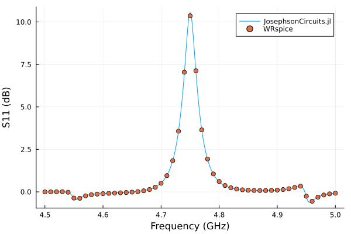

# Double-pumped Josephson parametric amplifier (JPA)

Drive the JPA with two independent strong tones and inspect the response between them. Each pump adds a Fourier-grid dimension, so refine the harmonic limits while watching memory use.

Requires `JosephsonCircuits` and `Plots`. The optional comparison uses
WRspice through `XicTools_jll`, or a local WRspice installation.

The JPA of the [first example](jpa.md), both pumps driving port 1:

```text
 1                  2
 o------[cc]--------o--------+
 |                  |        |
[p1]              [jj]     [cj]
 |                  |        |
 o------------------o--------+
 0
```

```@example doublepump
using JosephsonCircuits
using Plots

R = 50.0
Cc = 100.0e-15
Lj = 1000.0e-12
Cj = 1000.0e-15

# each entry is the name, the nodes of the two terminals, and the
# component; node 0 is ground
circuit = Circuit(
    [(:p1, 1, 0, Port(1; Z0 = R)),
     (:cc, 1, 2, Capacitor(Cc)),
     (:jj, 2, 0, JosephsonJunction(Lj)),
     (:cj, 2, 0, Capacitor(Cj))])

ws = 2*pi*(4.5:0.001:5.0)*1e9
wp = (2*pi*4.65001*1e9,2*pi*4.85001*1e9)

Ip = 0.00565e-6*1.7
sources = [(mode=(1,0),port=1,current=Ip),(mode=(0,1),port=1,current=Ip)]
Npumpharmonics = (8,8)
Nmodulationharmonics = (8,8)

nothing # hide
```

The full frequency sweep and plot use this setup:

```julia
jpa = hbsolve(ws, wp, sources, Nmodulationharmonics,
    Npumpharmonics, circuit);
@assert jpa.nonlinear.solverinfo.converged

plot(
    jpa.linearized.w/(2*pi*1e9),
    10*log10.(abs2.(
        jpa.linearized.S(
            outputmode=(0,0),
            outputport=1,
            inputmode=(0,0),
            inputport=1,
            freqindex=:
        ),
    )),
    label="JosephsonCircuits.jl",
    xlabel="Frequency (GHz)",
    ylabel="S11 (dB)",
)
```

## A small executable check

The documentation build runs three signal frequencies and a smaller grid
using the same circuit and sources. This catches interface drift; it does
not validate convergence of the full gain curve above.

```@example doublepump
small = hbsolve(2pi .* [4.6e9, 4.7e9, 4.8e9], wp, sources,
    (2,2), (4,4), circuit)
@assert small.nonlinear.solverinfo.converged
@assert all(isfinite, small.linearized.S)
nothing # hide
```

## Compare with WRspice

```julia
using XicTools_jll

wswrspice=2*pi*(4.5:0.01:5.0)*1e9
n = JosephsonCircuits.exportnetlist(circuit);
input = JosephsonCircuits.wrspice_input_paramp(n.netlist,wswrspice,[wp[1],wp[2]],[2*Ip,2*Ip],(0,1),[(0,1),(0,1)]);

output = JosephsonCircuits.spice_run(input,XicTools_jll.wrspice());
S11,S21=JosephsonCircuits.wrspice_calcS_paramp(output,wswrspice,n.Nnodes,stepsperperiod = 50000);

plot!(wswrspice/(2*pi*1e9),10*log10.(abs2.(S11)),
    label="WRspice",
    seriestype=:scatter)
```


