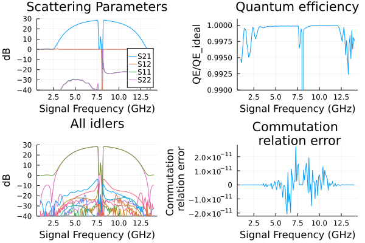
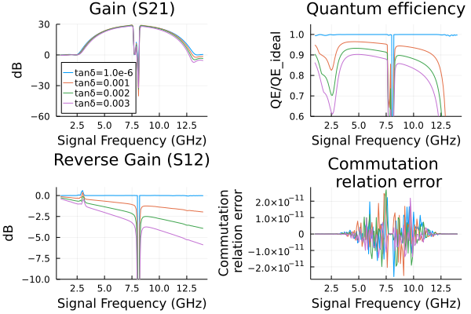

# Floquet JTWPA

Taper the unit-cell parameters of a traveling-wave amplifier, then add dielectric loss. The second section reuses `floquetcircuit` from the first. Compare gain and normalized quantum efficiency, and check convergence of the harmonic truncations.

The plotting code requires `Plots` in addition to `JosephsonCircuits`.

Figures and timings come from the original reference run using 16 threads
on an AMD Ryzen 9 9950X under Linux. Rerun the code for your package version
and numerical settings; see [benchmarking](../performance.md#Measuring-performance).

Circuit parameters from [the source publication](https://journals.aps.org/prxquantum/abstract/10.1103/PRXQuantum.3.020306).

```julia
using JosephsonCircuits
using Plots

# a circuit builder: an ordinary function from design parameters to a
# numeric circuit, so parameter changes (like the dielectric loss below)
# are just calls with different keyword arguments
function floquetcircuit(; Rleft = 50.0, Rright = 50.0, Lj = IctoLj(1.75e-6),
    Cg = 76.6e-15, Cc = 40.0e-15, Cr = 1.533e-12, Lr = 2.47e-10, Cj = 40e-15,
    Nj = 2000, pmrpitch = 8, weightwidth = 745)

    weight = (n,Nnodes,weightwidth) -> exp(-(n - Nnodes/2)^2/(weightwidth)^2)

    # the same unit cells as the uniform line, with the junction and
    # capacitance values weighted per cell
    jjcell(Lj, Cj, Cg) = Circuit(
        [(:jj, 1, 2, JosephsonJunction(Lj)),
         (:cj, 1, 2, Capacitor(Cj)),
         (:cg, 1, 0, Capacitor(Cg))];
        pins = [1 => (:jj, 1), 2 => (:jj, 2)])
    pmrcell(Lj, Cj, Cg, Cc, Cr, Lr) = Circuit(
        [(:jj, 1, 2, JosephsonJunction(Lj)),
         (:cj, 1, 2, Capacitor(Cj)),
         (:cg, 1, 0, Capacitor(Cg - Cc)),
         (:cc, 1, 3, Capacitor(Cc)),
         (:cr, 3, 0, Capacitor(Cr)),
         (:lr, 3, 0, Inductor(Lr))];
        pins = [1 => (:jj, 1), 2 => (:jj, 2)])

    # cell i sits between nodes i and i+1
    netlist = Any[(:p1, 1, 0, Port(1; Z0 = Rleft))]
    for i in 1:Nj-1
        wj = weight(i, Nj, weightwidth)
        wg = weight(i - 0.5, Nj, weightwidth)
        cell = if i == 1
            jjcell(Lj*wj, Cj/wj, Cg/2*wg)
        elseif mod(i, pmrpitch) == pmrpitch÷2
            pmrcell(Lj*wj, Cj/wj, Cg*wg, Cc*wg, Cr, Lr)
        else
            jjcell(Lj*wj, Cj/wj, Cg*wg)
        end
        push!(netlist, (Symbol(:cell, i), i, i+1, cell))
    end
    push!(netlist,
        (:cend, Nj, 0, Capacitor(Cg/2*weight(Nj - 0.5, Nj, weightwidth))))
    push!(netlist, (:p2, Nj, 0, Port(2; Z0 = Rright)))

    return Circuit(netlist)
end

circuit = floquetcircuit()

ws=2*pi*(1.0:0.1:14)*1e9
wp=(2*pi*7.9*1e9,)
Ip=1.1e-6
sources = [(mode=(1,),port=1,current=Ip)]
Npumpharmonics = (20,)
Nmodulationharmonics = (10,)

@time floquet = hbsolve(ws, wp, sources, Nmodulationharmonics,
    Npumpharmonics, circuit)
@assert floquet.nonlinear.solverinfo.converged

p1=plot(ws/(2*pi*1e9),
    10*log10.(abs2.(floquet.linearized.S((0,),2,(0,),1,:))),
    ylim=(-40,30),label="S21",
    xlabel="Signal Frequency (GHz)",
    legend=:bottomright,
    title="Scattering Parameters",
    ylabel="dB")

plot!(ws/(2*pi*1e9),
    10*log10.(abs2.(floquet.linearized.S((0,),1,(0,),2,:))),
    label="S12",
    )

plot!(ws/(2*pi*1e9),
    10*log10.(abs2.(floquet.linearized.S((0,),1,(0,),1,:))),
    label="S11",
    )

plot!(ws/(2*pi*1e9),
    10*log10.(abs2.(floquet.linearized.S((0,),2,(0,),2,:))),
    label="S22",
    )

p2=plot(ws/(2*pi*1e9),
    floquet.linearized.QE((0,),2,(0,),1,:)./floquet.linearized.QEideal((0,),2,(0,),1,:),
    ylim=(0.99,1.001),
    title="Quantum efficiency",legend=false,
    ylabel="QE/QE_ideal",xlabel="Signal Frequency (GHz)");

p3=plot(ws/(2*pi*1e9),
    10*log10.(abs2.(floquet.linearized.S(:,2,(0,),1,:)')),
    ylim=(-40,30),label="S21",
    xlabel="Signal Frequency (GHz)",
    legend=false,
    title="All idlers",
    ylabel="dB")

p4=plot(ws/(2*pi*1e9),
    1 .- floquet.linearized.CM((0,),2,:),
    legend=false,title="Commutation \n relation error",
    ylabel="Commutation \n relation error",xlabel="Signal Frequency (GHz)");

plot(p1, p2, p3,p4,layout = (2, 2))
```

```
  2.079267 seconds (456.63 k allocations: 1.997 GiB, 0.48% gc time)
```



## Floquet JTWPA with dissipation

Dissipation due to capacitors with dielectric loss, parameterized by a loss tangent. Run the above code block to define the circuit then run the following:

```julia
results = []
tandeltas = [1.0e-6,1.0e-3, 2.0e-3, 3.0e-3]
for tandelta in tandeltas
    # dielectric loss enters through complex capacitances, so build the
    # circuit again with lossy values
    lossycircuit = floquetcircuit(
        Cg = 76.6e-15/(1+im*tandelta),
        Cc = 40.0e-15/(1+im*tandelta),
        Cr = 1.533e-12/(1+im*tandelta),
    )
    wp=(2*pi*7.9*1e9,)
    ws=2*pi*(1.0:0.1:14)*1e9
    Ip=1.1e-6*(1+125*tandelta)
    sources = [(mode=(1,),port=1,current=Ip)]
    Npumpharmonics = (20,)
    Nmodulationharmonics = (10,)
    @time floquet = hbsolve(ws, wp, sources, Nmodulationharmonics,
        Npumpharmonics, lossycircuit)
@assert floquet.nonlinear.solverinfo.converged
    push!(results,floquet)
end

p1 = plot(title="Gain (S21)")
for i = 1:length(results)
        plot!(ws/(2*pi*1e9),
            10*log10.(abs2.(results[i].linearized.S((0,),2,(0,),1,:))),
            ylim=(-60,30),label="tanδ=$(tandeltas[i])",
            legend=:bottomleft,
            xlabel="Signal Frequency (GHz)",ylabel="dB")
end

p2 = plot(title="Quantum Efficiency")
for i = 1:length(results)
        plot!(ws/(2*pi*1e9),
            results[i].linearized.QE((0,),2,(0,),1,:)./results[i].linearized.QEideal((0,),2,(0,),1,:),
            ylim=(0.6,1.05),legend=false,
            title="Quantum efficiency",
            ylabel="QE/QE_ideal",xlabel="Signal Frequency (GHz)")
end

p3 = plot(title="Reverse Gain (S12)")
for i = 1:length(results)
        plot!(ws/(2*pi*1e9),
            10*log10.(abs2.(results[i].linearized.S((0,),1,(0,),2,:))),
            ylim=(-10,1),legend=false,
            xlabel="Signal Frequency (GHz)",ylabel="dB")
end

p4 = plot(title="Commutation \n relation error")
for i = 1:length(results)
        plot!(ws/(2*pi*1e9),
            1 .- results[i].linearized.CM((0,),2,:),
            legend=false,
            ylabel="Commutation\n relation error",xlabel="Signal Frequency (GHz)")
end

plot(p1, p2, p3,p4,layout = (2, 2))
```

```
  3.815835 seconds (470.00 k allocations: 2.303 GiB, 0.22% gc time)
  3.800166 seconds (470.59 k allocations: 2.310 GiB, 0.29% gc time)
  3.824690 seconds (470.75 k allocations: 2.317 GiB, 0.19% gc time)
  3.838721 seconds (470.75 k allocations: 2.317 GiB, 0.18% gc time)
```


