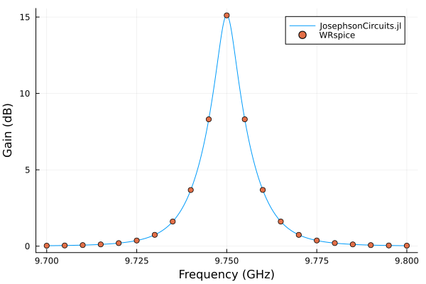
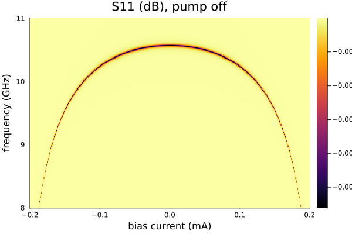

# Flux-pumped Josephson parametric amplifier (JPA)

Bias a SQUID through a mutual inductor and apply a pump near twice its resonance. The DC and three-wave-mixing options retain the modes needed by the flux bias and pump. The final sweep maps the pump-off resonance against bias.

Requires `JosephsonCircuits` and `Plots`. The optional comparison uses
WRspice through `XicTools_jll`, or a local WRspice installation.

Figures and timings come from the original reference run using 16 threads
on an AMD Ryzen 9 9950X under Linux. Rerun the code for your package version
and numerical settings; see [benchmarking](../performance.md#Measuring-performance).

Circuit and parameters from [Yamamoto et al. (2008)](https://doi.org/10.1063/1.2964182).

```julia
using JosephsonCircuits
using Plots

R = 50.0
Cc = 16.0e-15
Cj = 10.0e-15
Lj = 219.63e-12
Cr = 0.4e-12
Lr = 0.4264e-9
Ll = 34e-12
Ldc = 0.74e-12
K = 0.999 # the coupling of the bias inductor ldc to the loop inductor ll

circuit = Circuit(
    [(:p1, 1, 0, Port(1; Z0 = R)),
     (:cc, 1, 2, Capacitor(Cc)),
     (:lr, 2, 3, Inductor(Lr)), (:cr, 2, 0, Capacitor(Cr)),
     (:jj1, 3, 0, JosephsonJunction(Lj)), (:cj1, 3, 0, Capacitor(Cj)),
     (:ll, 3, 4, Inductor(Ll)),
     (:jj2, 4, 0, JosephsonJunction(Lj)), (:cj2, 4, 0, Capacitor(Cj)),
     # the bias inductor, mutually coupled to the loop inductor ll
     (:ldc, 5, 0, Inductor(Ldc)),
     (:k1, :ll, :ldc, MutualInductor(K)),
     # a high impedance port, so the bias may be applied across it
     (:p2, 5, 0, Port(2; Z0 = 1000.0))])

ws = 2*pi*(9.7:0.0001:9.8)*1e9
wp = (2*pi*19.50*1e9,)
Ip = 0.7e-6
Idc = 140.3e-6
# add the DC bias and pump to port 2
sourcespumpon = [(mode=(0,),port=2,current=Idc),(mode=(1,),port=2,current=Ip)]
Npumpharmonics = (16,)
Nmodulationharmonics = (8,)
@time jpapumpon = hbsolve(ws, wp, sourcespumpon, Nmodulationharmonics,
    Npumpharmonics, circuit, dc = true, threewavemixing=true,fourwavemixing=true) # enable dc and three wave mixing
@assert jpapumpon.nonlinear.solverinfo.converged

plot(
    jpapumpon.linearized.w/(2*pi*1e9),
    10*log10.(abs2.(
        jpapumpon.linearized.S(
            outputmode=(0,),
            outputport=1,
            inputmode=(0,),
            inputport=1,
            freqindex=:
        ),
    )),
    xlabel="Frequency (GHz)",
    ylabel="Gain (dB)",
    label="JosephsonCircuits.jl",
)
```

```
  0.015623 seconds (22.07 k allocations: 80.082 MiB)
```

## Compare with WRspice

```julia
using XicTools_jll

# simulate the JPA in WRSPICE
wswrspice=2*pi*(9.7:0.005:9.8)*1e9
n = JosephsonCircuits.exportnetlist(circuit);
input = JosephsonCircuits.wrspice_input_paramp(n.netlist,wswrspice,[0.0,wp[1]],[Idc,2*Ip],[(0,1)],[(0,5),(0,5)];trise=10e-9,tstop=600e-9);
@time output = JosephsonCircuits.spice_run(input,XicTools_jll.wrspice());
S11,S21=JosephsonCircuits.wrspice_calcS_paramp(output,wswrspice,n.Nnodes);

# plot the output
plot!(wswrspice/(2*pi*1e9),10*log10.(abs2.(S11)),
    label="WRspice",
    seriestype=:scatter)
```

```
283.557011 seconds (26.76 k allocations: 7.205 GiB, 0.66% gc time)
```



Simulate the JPA frequency as a function of DC bias current:

```julia
ws = 2*pi*(8.0:0.01:11.0)*1e9
currentvals = (-15:0.1:15)*1e-5
outvals = zeros(Complex{Float64},length(ws),length(currentvals))
Ip=0.0

Npumpharmonics = (1,)
Nmodulationharmonics = (1,)

@time for (k,Idc) in enumerate(currentvals)
    sources = [
          (mode=(0,),port=2,current=Idc),
          (mode=(1,),port=2,current=Ip),
      ]
    sol = hbsolve(ws,wp,sources,Nmodulationharmonics, Npumpharmonics,
        circuit;dc=true,threewavemixing=true,fourwavemixing=true)
    outvals[:,k]=sol.linearized.S((0,),1,(0,),1,:)
end

plot(
    currentvals/(1e-3),
    ws/(2*pi*1e9),
    10*log10.(abs2.(outvals)),
    seriestype=:heatmap,
    xlabel="bias current (mA)",
    ylabel="frequency (GHz)",
    title="S11 (dB), pump off",
)
```

```
0.219279 seconds (3.27 M allocations: 639.981 MiB, 20.84% gc time)
```


