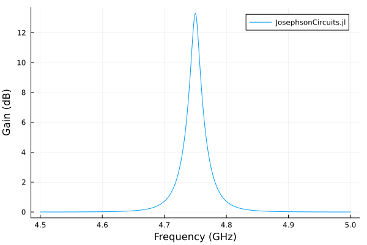
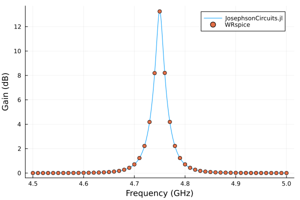

# Josephson parametric amplifier (JPA)

Calculate reflection gain near the resonance of a current-pumped JPA, then compare with WRspice. The signal-frequency sweep uses the small-signal response about the strong pump. Refine both harmonic limits before interpreting the peak gain.

Requires `JosephsonCircuits` and `Plots`. The optional comparison uses
WRspice through `XicTools_jll`, or a local WRspice installation.

For temporal stability of this pumped circuit, continue with the
[worked pole-analysis example](../stability.md#stability-jpa),
including harmonic refinement.

Figures and timings come from the original reference run using 16 threads
on an AMD Ryzen 9 9950X under Linux. Rerun the code for your package version
and numerical settings; see [benchmarking](../performance.md#Measuring-performance).

```julia
using JosephsonCircuits
using Plots

R = 50.0
Cc = 100.0e-15
Lj = 1000.0e-12
Cj = 1000.0e-15

# each entry is the name, the nodes of the two terminals, and the
# component; node 0 is ground
circuit = Circuit(
    [(:p1, 1, 0, Port(1; Z0 = R)),
     (:cc, 1, 2, Capacitor(Cc)),
     (:jj, 2, 0, JosephsonJunction(Lj)),
     (:cj, 2, 0, Capacitor(Cj))])

ws = 2*pi*(4.5:0.001:5.0)*1e9
wp = (2*pi*4.75001*1e9,)
Ip = 0.00565e-6
sources = [(mode=(1,),port=1,current=Ip)]
Npumpharmonics = (16,)
Nmodulationharmonics = (8,)

@time jpa = hbsolve(ws, wp, sources, Nmodulationharmonics,
    Npumpharmonics, circuit)
@assert jpa.nonlinear.solverinfo.converged

plot(
    jpa.linearized.w/(2*pi*1e9),
    10*log10.(abs2.(
        jpa.linearized.S(
            outputmode=(0,),
            outputport=1,
            inputmode=(0,),
            inputport=1,
            freqindex=:
        ),
    )),
    label="JosephsonCircuits.jl",
    xlabel="Frequency (GHz)",
    ylabel="Gain (dB)",
)
```

```
  0.001817 seconds (12.99 k allocations: 4.361 MiB)
```



Compare with WRspice. Please note that on Linux you can install the [XicTools_jll](https://github.com/JuliaBinaryWrappers/XicTools_jll.jl/) package which provides WRspice for x86_64. For other operating systems and platforms, you can install WRspice yourself and substitute `XicTools_jll.wrspice()` with `JosephsonCircuits.wrspice_cmd()` which will attempt to provide the path to your WRspice executable.

```julia
using XicTools_jll

wswrspice=2*pi*(4.5:0.01:5.0)*1e9
n = JosephsonCircuits.exportnetlist(circuit);
input = JosephsonCircuits.wrspice_input_paramp(n.netlist,wswrspice,wp[1],2*Ip,(0,1),(0,1));

@time output = JosephsonCircuits.spice_run(input,XicTools_jll.wrspice());
S11,S21=JosephsonCircuits.wrspice_calcS_paramp(output,wswrspice,n.Nnodes);

plot!(wswrspice/(2*pi*1e9),10*log10.(abs2.(S11)),
    label="WRspice",
    seriestype=:scatter)

```

```
 12.743245 seconds (32.66 k allocations: 499.263 MiB, 0.41% gc time)
```


