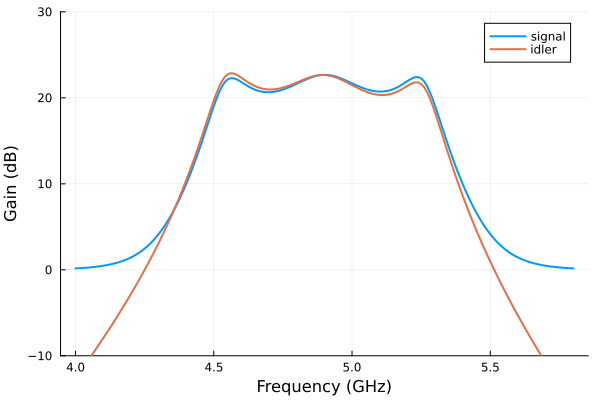

# Impedance-engineered JPA

Build an impedance-engineered JPA from nested snake and SQUID subcircuits. The signal and conjugate-idler curves are plotted in power units, so the idler conversion includes the absolute frequency ratio.

The plotting code requires `Plots` in addition to `JosephsonCircuits`.

Figures and timings come from the original reference run using 16 threads
on an AMD Ryzen 9 9950X under Linux. Rerun the code for your package version
and numerical settings; see [benchmarking](../performance.md#Measuring-performance).

Circuit parameters of the lumped-element snake amplifier (LESA) from [Naaman et al. (2024)](https://arxiv.org/abs/2408.07861). The device is built from hierarchical subcircuits -- a snake stage, a snake, and the four-snake flux-biased SQUID -- and its matching network ends in an ideal transmission line expressed directly as a frequency dependent scattering parameter block rather than a discretized LC ladder.

Utility functions
```julia
using JosephsonCircuits, Plots

function calc_Lsnake(N,L1,L2,LJ,delta0)
   return N/2*((L1+L2)*LJ+L1*L2*cos(delta0))/(LJ+(4*L1+L2)*cos(delta0))
end

"""
    snakestage(L1, L2, Lj, odd)

One stage of a `snake`: the two arms of the stage -- a Josephson junction
on one and a linear inductor `L2` on the other, swapping arms on
alternating stages -- and the `L1` rung tying the arm outputs together.
Pins 1 and 2 are the arm inputs, pins 3 and 4 the arm outputs.
"""
snakestage(L1, L2, Lj, odd) = Circuit(
    [(:u, 1, 3, odd ? JosephsonJunction(Lj) : Inductor(L2)),
     (:l, 2, 4, odd ? Inductor(L2) : JosephsonJunction(Lj)),
     (:rung, 3, 4, Inductor(L1))];
    pins = [1 => (:u, 1), 2 => (:l, 1), 3 => (:u, 2), 4 => (:l, 2)])

"""
    snake(L1, L2, Lj, Nstages)

A `snake`, a tunable inductor made of two rf-SQUID arrays in parallel as
detailed in arXiv:2209.07757 and PhysRevLett.109.137003: an `L1` rung
across the input, then `Nstages` chained stages.

       <---------Nstages----- ... --->
    1 o--Lj--o--L2--o--Lj- ... -o--L2--o
      |      |      |           |      |
      L1     L1     L1          L1     L1
      |      |      |           |      |
      o--L2--o--Lj--o--L2- ...  o--Lj--o 2

Pin 1 is the start of the upper arm and pin 2 the end of the lower arm.
"""
function snake(L1, L2, Lj, Nstages)
    # the upper and lower arm nodes u1, l1, u2, l2, ... along the snake:
    # stage i spans (ui, li) to (u(i+1), l(i+1))
    netlist = Any[(:rung0, "u1", "l1", Inductor(L1))]
    for i in 1:Nstages
        push!(netlist, (Symbol(:stage, i), "u$i", "l$i", "u$(i+1)", "l$(i+1)",
            snakestage(L1, L2, Lj, isodd(i))))
    end
    return Circuit(netlist;
        pins = [1 => (:stage1, 1), 2 => (Symbol(:stage, Nstages), 4)])
end

"""
    snakesquid(L1, L2, L3, Lj, Lb, K, R, Nstages)

A SQUID made of four `snakes`, flux biased through a port: two arms in
parallel from the single signal pin, each arm two snakes in series
through `L3`, each arm ending in an inductor `Lb` to ground which is
mutually coupled to one of the two bias inductors in series across the
bias port. A positive coupling coefficient adds flux for currents in the
direction the inductors' terminals are declared in, and with both arm
inductors declared toward ground the SQUID loop runs down one arm and up
the other, so the bias current threads the loop through a coupling of
`K` on one arm and `-K` on the other.

    pin 1 o---snake---L3---snake---Lb---gnd   (K to Lb1)
          |
          o---snake---L3---snake---Lb---gnd   (-K to Lb2)

    Port 2 o--R--gnd, with Lb1 and Lb2 in series across it
"""
function snakesquid(L1, L2, L3, Lj, Lb, K, R, Nstages)
    netlist = Any[
        # arm a: node 1 is the signal pin
        (:a1, 1, 2, snake(L1, L2, Lj, Nstages)), (:l3a, 2, 3, Inductor(L3)),
        (:a2, 3, 4, snake(L1, L2, Lj, Nstages)), (:lba, 4, 0, Inductor(Lb)),
        # arm b
        (:b1, 1, 5, snake(L1, L2, Lj, Nstages)), (:l3b, 5, 6, Inductor(L3)),
        (:b2, 6, 7, snake(L1, L2, Lj, Nstages)), (:lbb, 7, 0, Inductor(Lb)),
        # the bias port, with its two inductors in series across it, each
        # coupled to one arm; the loop runs down arm a and up arm b, so the
        # bias current threads it through couplings of opposite sign
        (:p2, 8, 0, Port(2; Z0 = R)),
        (:lb1, 8, 9, Inductor(Lb)), (:lb2, 9, 0, Inductor(Lb)),
        (:kb1, :lba, :lb1, MutualInductor(K)),
        (:kb2, :lbb, :lb2, MutualInductor(-K))]
    return Circuit(netlist; pins = [1 => (:a1, 1)])
end

"""
    tline(theta, w0, Z0)

An ideal transmission line with electrical length `theta` at frequency
`w0` and characteristic impedance `Z0`, as a two port scattering
parameter block: the exact line response, in place of a discretized LC
ladder approximation. The scattering matrix is assembled at each
requested frequency from the ABCD parameters of a line of electrical
length `theta*w/w0`.
"""
function tline(theta, w0, Z0)
    S!(dest, w) = JosephsonCircuits.ABCDtoS!(
        JosephsonCircuits.ABCD_tline!(dest, Z0, theta*w/w0), Z0)
    return ScatteringParameters(S!; nports = 2, zref = Z0, form = :inplace,
        noise = Lossless())
end
```

LESA simulation
```julia
R = 50.0
Lj = JosephsonCircuits.IctoLj(16e-6)
L1 = 2.6e-12
L2 = 8.0e-12
L3 = 5e-12
Lb = 60e-12
K = 0.5*50/sqrt(60*60)
C1 = 6.607e-12
C6 = 0.743e-12
C7 = 0.265e-12
PLCC = 0.654e-12
PLCL = 0.650e-9
L22 = 1.320e-9

Nstages_snake = 10

Z0 = 50.0
w0 = 2*pi*4.9e9
theta = 32.6*pi/180

# the snake SQUID X1 shunts the signal node; C6, the parallel LC, C7 and
# the transmission line -- a scattering parameter block with the exact
# line response -- form the impedance matching network to the port
circuit = Circuit(
    [(:x1, 1, snakesquid(L1, L2, L3, Lj, Lb, K, R, Nstages_snake)),
     (:c1, 1, 0, Capacitor(C1)), (:c6, 1, 2, Capacitor(C6)),
     (:plcc, 2, 0, Capacitor(PLCC)), (:plcl, 2, 0, Inductor(PLCL)),
     (:c7, 2, 3, Capacitor(C7)),
     # a grounded two port block lists the signal node of each port
     (:tl, 3, 4, tline(theta, w0, Z0)),
     (:l22, 4, 0, Inductor(L22)), (:p1, 4, 0, Port(1; Z0 = R))])
ws = 2*pi*(4.0:0.01:5.8)*1e9
wp = (2*pi*9.8001*1e9,)
Ip = 0.247e-3
Idc = 0.686e-3
# add the DC bias and pump to port 2
sourcespumpon = [(mode=(0,),port=2,current=Idc),(mode=(1,),port=2,current=Ip)]
Npumpharmonics = (8,)
Nmodulationharmonics = (4,)
@time sol = hbsolve(ws, wp, sourcespumpon, Nmodulationharmonics,
    Npumpharmonics, circuit, dc = true, threewavemixing=true,fourwavemixing=true,
        iterations=200,
)
@assert sol.nonlinear.solverinfo.converged

plot(
    sol.linearized.w/(2*pi*1e9),
    10*log10.(abs2.(
        sol.linearized.S(
            outputmode=(0,),
            outputport=1,
            inputmode=(0,),
            inputport=1,
            freqindex=:
        ),
    )),
    xlabel="Frequency (GHz)",
    ylabel="Gain (dB)",
    label="signal",
    linewidth=2,
    ylim=(-10,30),
)

plot!(
    sol.linearized.w/(2*pi*1e9),
    10*log10.(abs2.(
        sol.linearized.S(
            outputmode=(-1,),
            outputport=1,
            inputmode=(0,),
            inputport=1,
            freqindex=:
        ).*sqrt.(abs.((wp.-sol.linearized.w)./sol.linearized.w)), # convert from photon number to power
    )),
    linewidth=2,
    xlabel="Frequency (GHz)",
    ylabel="Gain (dB)",
    label="idler",
)

```

```
  0.081631 seconds (34.78 k allocations: 67.609 MiB, 48.06% gc time)
```


