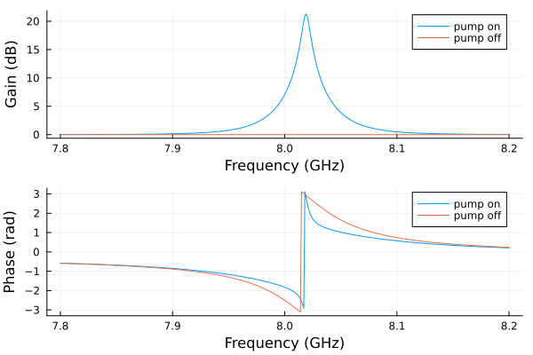
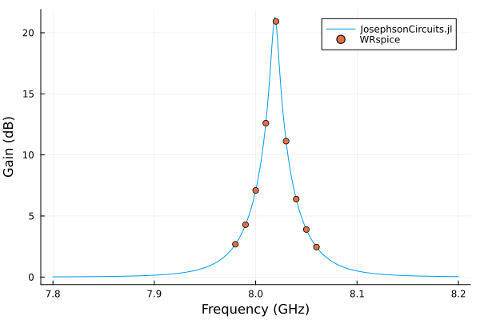

# SNAIL Parametric Amplifier

Compare pump-on and pump-off gain for an explicitly modeled SNAIL. The quadratic nonlinearity supports three-wave mixing. Similar resonance frequencies in the two curves indicate operation near the chosen Kerr-free point.

Requires `JosephsonCircuits` and `Plots`. The optional comparison uses
WRspice through `XicTools_jll`, or a local WRspice installation.

The SNAIL follows [Frattini et al. (2018)](https://doi.org/10.1103/PhysRevApplied.10.054020).
A resonator, `lr` and `cr`, ends in a SNAIL: a small junction `jj1` in a
loop with three large ones in series, `jj2` to `jj4`, and the loop
inductance `ll`; port 2, of 1 kΩ, drives the bias line `ldc`, coupled to
`ll` by `k1`. The small junction has `alpha` times the area of the large
ones, so `alpha` times their critical current and capacitance. The
resonator, 1.25 times that of the [flux-pumped example](flux-pump.md), and
the bias line, `Ll`, `Ldc` and `K` of that example, are assumed, as are
the bias and the pump, at twice the pump-off resonance of 8.019 GHz:

```text
 1          2          3             4                5                6
 o---[cc]---o---[lr]---o----[ll]-----o--[jj2 || cj2]--o--[jj3 || cj3]--o
 |          |          |                                               |
[p1]      [cr]   [jj1 || cj1]                                    [jj4 || cj4]
 |          |          |                                               |
 o----------o----------o-----------------------------------------------o
 0

 7
 o
 |
[p2 || ldc]      ldc coupled to ll by k1
 |
 o
 0
```

```@example snail
using JosephsonCircuits
using Plots

R = 50.0
Cc = 0.048e-12
Cj = 10.0e-15
Lj = 60e-12
Cr = 0.4e-12*1.25
Lr = 0.4264e-9*1.25
Ll = 34e-12
Ldc = 0.74e-12
K = 0.999 # the coupling of the bias inductor ldc to the loop inductor ll

alpha = 0.29 # the area of the small junction relative to the large ones
circuit = Circuit(
    [(:p1, 1, 0, Port(1; Z0 = R)),
     (:cc, 1, 2, Capacitor(Cc)),
     (:lr, 2, 3, Inductor(Lr)), (:cr, 2, 0, Capacitor(Cr)),
     # the small junction of the SNAIL, across the three large ones
     (:jj1, 3, 0, JosephsonJunction(Lj/alpha)),
     (:cj1, 3, 0, Capacitor(alpha*Cj)),
     (:ll, 3, 4, Inductor(Ll)),
     (:jj2, 4, 5, JosephsonJunction(Lj)), (:cj2, 4, 5, Capacitor(Cj)),
     (:jj3, 5, 6, JosephsonJunction(Lj)), (:cj3, 5, 6, Capacitor(Cj)),
     (:jj4, 6, 0, JosephsonJunction(Lj)), (:cj4, 6, 0, Capacitor(Cj)),
     # the bias inductor, mutually coupled to the loop inductor ll
     (:ldc, 7, 0, Inductor(Ldc)),
     (:k1, :ll, :ldc, MutualInductor(K)),
     # a high impedance port, so the bias may be applied across it
     (:p2, 7, 0, Port(2; Z0 = 1000.0))])
ws = 2*pi*(7.8:0.001:8.2)*1e9
wp = (2*pi*16.038*1e9,)
Ip = 4.7e-6
Idc = 0.000159
# add the DC bias and pump to port 2
sourcespumpon = [(mode=(0,),port=2,current=Idc),(mode=(1,),port=2,current=Ip)]
sourcespumpoff = [(mode=(0,),port=2,current=Idc),(mode=(1,),port=2,current=0.0)]
Npumpharmonics = (16,)
Nmodulationharmonics = (8,)
nothing # hide
```

The full sweep and plotting commands continue this setup:

```julia
jpapumpon = hbsolve(ws, wp, sourcespumpon, Nmodulationharmonics,
    Npumpharmonics, circuit, dc = true, threewavemixing=true,fourwavemixing=true) # enable dc and three wave mixing
@assert jpapumpon.nonlinear.solverinfo.converged
jpapumpoff = hbsolve(ws, wp, sourcespumpoff, Nmodulationharmonics,
    Npumpharmonics, circuit, dc = true, threewavemixing=true,fourwavemixing=true) # enable dc and three wave mixing
@assert jpapumpoff.nonlinear.solverinfo.converged

p1 = plot(
    jpapumpon.linearized.w/(2*pi*1e9),
    10*log10.(abs2.(
        jpapumpon.linearized.S(
            outputmode=(0,),
            outputport=1,
            inputmode=(0,),
            inputport=1,
            freqindex=:
        ),
    )),
    xlabel="Frequency (GHz)",
    ylabel="Gain (dB)",
    label="pump on",
)

plot!(
    jpapumpoff.linearized.w/(2*pi*1e9),
    10*log10.(abs2.(
        jpapumpoff.linearized.S(
            outputmode=(0,),
            outputport=1,
            inputmode=(0,),
            inputport=1,
            freqindex=:
        ),
    )),
    label="pump off",
)

p2 = plot(
    jpapumpon.linearized.w/(2*pi*1e9),
    angle.(
        jpapumpon.linearized.S(
            outputmode=(0,),
            outputport=1,
            inputmode=(0,),
            inputport=1,
            freqindex=:
        ),
    ),
    xlabel="Frequency (GHz)",
    ylabel="Phase (rad)",
    label="pump on",
)

plot!(
    jpapumpoff.linearized.w/(2*pi*1e9),
    angle.(
        jpapumpoff.linearized.S(
            outputmode=(0,),
            outputport=1,
            inputmode=(0,),
            inputport=1,
            freqindex=:
        ),
    ),
    label="pump off",
)
plot(p1,p2,layout=(2,1))
```



## A small executable check

The documentation build uses the same circuit and bias/pump sources at
three signal frequencies. The smaller harmonic limits check the workflow;
refine them for a quantitative gain prediction.

```@example snail
small = hbsolve(2pi .* [7.9e9, 8.0e9, 8.1e9], wp, sourcespumpon,
    (4,), (8,), circuit; dc = true, threewavemixing = true,
    fourwavemixing = true, atol = 1e-8)
@assert small.nonlinear.solverinfo.converged
@assert all(isfinite, small.linearized.S)
@assert maximum(abs.(abs.(small.linearized.CM) .- 1)) < 1e-5
nothing # hide
```

With the pump and the bias off the circuit is linear, and its reflection
has a closed form: the junctions are their inductances at zero phase, and
the loop of the bias line, `ldc` and the 1 kΩ port, is reflected into
`ll` through the mutual inductance `M = K sqrt(Ll Ldc)`:

```@example snail
function reflection(w)
    M = K*sqrt(Ll*Ldc)
    Zll = im*w*Ll + (w*M)^2/(im*w*Ldc + 1000.0)
    ZJ = 1/(1/(im*w*Lj) + im*w*Cj)
    Zsnail = 1/(1/(im*w*Lj/alpha) + im*w*alpha*Cj + 1/(Zll + 3ZJ))
    Z = 1/(im*w*Cc) + 1/(im*w*Cr + 1/(im*w*Lr + Zsnail))
    return (Z - R)/(Z + R)
end
wcheck = 2pi .* [7.9e9, 8.0e9, 8.1e9]
S11 = hblinsolve(wcheck, circuit).S((0,), 1, (0,), 1, :)
@assert isapprox(S11, reflection.(wcheck); atol = 1e-12)
(solver = S11, closed = reflection.(wcheck))
```

## Compare with WRspice

WRspice solves two 600 ns transients at each signal frequency, so the
comparison is made at nine frequencies around the gain peak:

```julia
using XicTools_jll

# simulate the SNAIL amplifier in WRSPICE
wswrspice=2*pi*(7.98:0.01:8.06)*1e9
n = JosephsonCircuits.exportnetlist(circuit);
input = JosephsonCircuits.wrspice_input_paramp(n.netlist,wswrspice,[0.0,wp[1]],[Idc,2*Ip],[(0,1)],[(0,7),(0,7)];trise=10e-9,tstop=600e-9);

output = JosephsonCircuits.spice_run(input,XicTools_jll.wrspice());
S11,S21=JosephsonCircuits.wrspice_calcS_paramp(output,wswrspice,n.Nnodes);

# plot the output
plot(
    jpapumpon.linearized.w/(2*pi*1e9),
    10*log10.(abs2.(
        jpapumpon.linearized.S(
            outputmode=(0,),
            outputport=1,
            inputmode=(0,),
            inputport=1,
            freqindex=:
        ),
    )),
    xlabel="Frequency (GHz)",
    ylabel="Gain (dB)",
    label="JosephsonCircuits.jl",
)

plot!(wswrspice/(2*pi*1e9),10*log10.(abs2.(S11)),
    label="WRspice",
    seriestype=:scatter)
```


