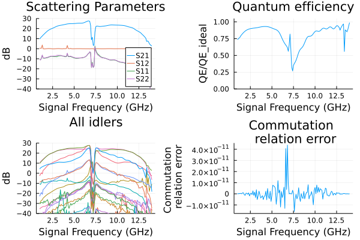

# Josephson traveling wave parametric amplifier (JTWPA)

Build a resonant-phase-matched JTWPA from repeated cells. Inspect forward and reverse gain, conversion to idlers, quantum efficiency, and the commutator error. This is a full device example; reduce the cell count for a quick syntax check, but do not expect the same gain.

The plotting code requires `Plots` in addition to `JosephsonCircuits`.

Figures and timings come from the original reference run using 16 threads
on an AMD Ryzen 9 9950X under Linux. Rerun the code for your package version
and numerical settings; see [benchmarking](../performance.md#Measuring-performance).

Circuit parameters from [the source publication](https://www.science.org/doi/10.1126/science.aaa8525).

```julia
using JosephsonCircuits
using Plots

Rleft = 50.0
Rright = 50.0
Cg = 45.0e-15
Lj = IctoLj(3.4e-6)
Cj = 55e-15
Cc = 30.0e-15
Cr = 2.8153e-12
Lr = 1.70e-10

# one unit cell of the line: a junction with its shunt capacitance and
# the capacitance to ground at its input, exposed through pins 1 and 2
jjcell(Lj, Cj, Cg) = Circuit(
    [(:jj, 1, 2, JosephsonJunction(Lj)),
     (:cj, 1, 2, Capacitor(Cj)),
     (:cg, 1, 0, Capacitor(Cg))];
    pins = [1 => (:jj, 1), 2 => (:jj, 2)])

# a cell whose capacitance to ground is split to couple a phase matching
# resonator
pmrcell(Lj, Cj, Cg, Cc, Cr, Lr) = Circuit(
    [(:jj, 1, 2, JosephsonJunction(Lj)),
     (:cj, 1, 2, Capacitor(Cj)),
     (:cg, 1, 0, Capacitor(Cg - Cc)),
     (:cc, 1, 3, Capacitor(Cc)),
     (:cr, 3, 0, Capacitor(Cr)),
     (:lr, 3, 0, Inductor(Lr))];
    pins = [1 => (:jj, 1), 2 => (:jj, 2)])

Nj = 2048
pmrpitch = 4

# instance the cells and chain them: cell i sits between nodes i and i+1
netlist = Any[(:p1, 1, 0, Port(1; Z0 = Rleft))]
for i in 1:Nj-1
    cell = if i == 1
        jjcell(Lj, Cj, Cg/2)             # half cap to ground at the input
    elseif mod(i, pmrpitch) == pmrpitch÷2
        pmrcell(Lj, Cj, Cg, Cc, Cr, Lr)
    else
        jjcell(Lj, Cj, Cg)
    end
    push!(netlist, (Symbol(:cell, i), i, i+1, cell))
end
push!(netlist, (:cend, Nj, 0, Capacitor(Cg/2)))
push!(netlist, (:p2, Nj, 0, Port(2; Z0 = Rright)))

circuit = Circuit(netlist)

ws=2*pi*(1.0:0.1:14)*1e9
wp=(2*pi*7.12*1e9,)
Ip=1.85e-6
sources = [(mode=(1,),port=1,current=Ip)]
Npumpharmonics = (20,)
Nmodulationharmonics = (10,)

@time rpm = hbsolve(ws, wp, sources, Nmodulationharmonics,
    Npumpharmonics, circuit)
@assert rpm.nonlinear.solverinfo.converged

p1=plot(ws/(2*pi*1e9),
    10*log10.(abs2.(rpm.linearized.S(
            outputmode=(0,),
            outputport=2,
            inputmode=(0,),
            inputport=1,
            freqindex=:),
    )),
    ylim=(-40,30),label="S21",
    xlabel="Signal Frequency (GHz)",
    legend=:bottomright,
    title="Scattering Parameters",
    ylabel="dB")

plot!(ws/(2*pi*1e9),
    10*log10.(abs2.(rpm.linearized.S((0,),1,(0,),2,:))),
    label="S12",
    )

plot!(ws/(2*pi*1e9),
    10*log10.(abs2.(rpm.linearized.S((0,),1,(0,),1,:))),
    label="S11",
    )

plot!(ws/(2*pi*1e9),
    10*log10.(abs2.(rpm.linearized.S((0,),2,(0,),2,:))),
    label="S22",
    )

p2=plot(ws/(2*pi*1e9),
    rpm.linearized.QE((0,),2,(0,),1,:)./rpm.linearized.QEideal((0,),2,(0,),1,:),
    ylim=(0,1.05),
    title="Quantum efficiency",legend=false,
    ylabel="QE/QE_ideal",xlabel="Signal Frequency (GHz)");

p3=plot(ws/(2*pi*1e9),
    10*log10.(abs2.(rpm.linearized.S(:,2,(0,),1,:)')),
    ylim=(-40,30),
    xlabel="Signal Frequency (GHz)",
    legend=false,
    title="All idlers",
    ylabel="dB")

p4=plot(ws/(2*pi*1e9),
    1 .- rpm.linearized.CM((0,),2,:),
    legend=false,title="Commutation \n relation error",
    ylabel="Commutation \n relation error",xlabel="Signal Frequency (GHz)");

plot(p1, p2, p3, p4, layout = (2, 2))
```

```
  2.959010 seconds (257.75 k allocations: 2.392 GiB, 0.21% gc time)
```


