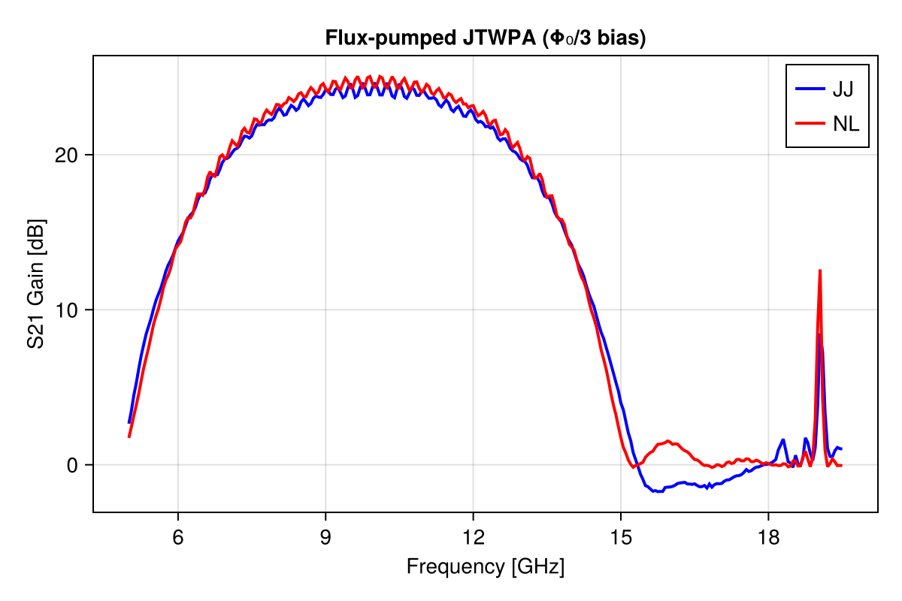
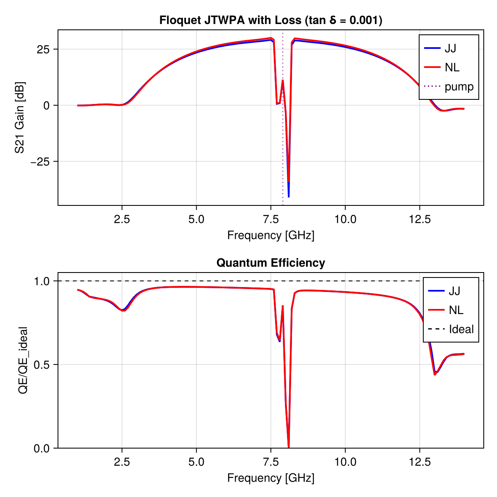

# Additional JosephsonCircuits.jl Examples

This folder contains additional circuit simulation examples demonstrating advanced features of JosephsonCircuits.jl, including flux-pumped TWPAs, Floquet JTWPA with dielectric loss, and Taylor expansion nonlinearity comparisons.

**Note**: Timing results shown in the examples below are from the original JosephsonCircuits.jl package and may differ when using the Taylor expansion features.

## Original Examples

## Double-pumped Josephson parametric amplifier (JPA)

<details>

<summary>Code</summary>

```julia
using JosephsonCircuits
using Plots

@variables R Cc Lj Cj
circuit = [
    ("P1","1","0",1),
    ("R1","1","0",R),
    ("C1","1","2",Cc),
    ("Lj1","2","0",Lj),
    ("C2","2","0",Cj)]

circuitdefs = Dict(
    Lj =>1000.0e-12,
    Cc => 100.0e-15,
    Cj => 1000.0e-15,
    R => 50.0)

ws = 2*pi*(4.5:0.001:5.0)*1e9
wp = (2*pi*4.65001*1e9,2*pi*4.85001*1e9)

Ip = 0.00565e-6*1.7
sources = [(mode=(1,0),port=1,current=Ip),(mode=(0,1),port=1,current=Ip)]
Npumpharmonics = (8,8)
Nmodulationharmonics = (8,8)

@time jpa = hbsolve(ws, wp, sources, Nmodulationharmonics,
    Npumpharmonics, circuit, circuitdefs);

plot(
    jpa.linearized.w/(2*pi*1e9),
    10*log10.(abs2.(
        jpa.linearized.S(
            outputmode=(0,0),
            outputport=1,
            inputmode=(0,0),
            inputport=1,
            freqindex=:
        ),
    )),
    label="JosephsonCircuits.jl",
    xlabel="Frequency (GHz)",
    ylabel="S11 (dB)",
)
```

</details>


```
  0.182720 seconds (12.70 k allocations: 713.087 MiB)
```

and compare with WRspice
<details>

<summary>Code</summary>

```julia
using XicTools_jll

wswrspice=2*pi*(4.5:0.01:5.0)*1e9
n = JosephsonCircuits.exportnetlist(circuit,circuitdefs);
input = JosephsonCircuits.wrspice_input_paramp(n.netlist,wswrspice,[wp[1],wp[2]],[2*Ip,2*Ip],(0,1),[(0,1),(0,1)]);

@time output = JosephsonCircuits.spice_run(input,XicTools_jll.wrspice());
S11,S21=JosephsonCircuits.wrspice_calcS_paramp(output,wswrspice,n.Nnodes,stepsperperiod = 50000);

plot!(wswrspice/(2*pi*1e9),10*log10.(abs2.(S11)),
    label="WRspice",
    seriestype=:scatter)
```

</details>


```
 15.782862 seconds (32.80 k allocations: 509.192 MiB, 0.39% gc time)
```


## Flux-pumped Josephson parametric amplifier (JPA)
Circuit and parameters from [here](https://doi.org/10.1063/1.2964182
). Please note that three wave mixing (3WM) and flux-biasing are relatively untested, so you may encounter bugs. Please file issues or PRs.
<details>

<summary>Code</summary>

```julia
using JosephsonCircuits
using Plots

@variables R Cc Cj Lj Cr Lr Ll Ldc K Lg
circuit = [
    ("P1","1","0",1),
    ("R1","1","0",R),
    # a very large inductor so the DC node flux of this node isn't floating
    ("L0","1","0",Lg), 
    ("C1","1","2",Cc),
    ("L1","2","3",Lr),
    ("C2","2","0",Cr),
    ("Lj1","3","0",Lj),
    ("Cj1","3","0",Cj),
    ("L2","3","4",Ll),
    ("Lj2","4","0",Lj),
    ("Cj2","4","0",Cj),
    ("L3","5","0",Ldc), 
    ("K1","L2","L3",K),
    # a port with a very large resistor so we can apply the bias across the port
    ("P2","5","0",2),
    ("R2","5","0",1000.0),
] 

circuitdefs = Dict(
    Lj =>219.63e-12,
    Lr =>0.4264e-9,
    Lg =>100.0e-9,
    Cc => 16.0e-15,
    Cj => 10.0e-15, 
    Cr => 0.4e-12,
    R => 50.0, 
    Ll => 34e-12, 
    K => 0.999, # the inverse inductance matrix for K=1.0 diverges, so set K<1.0
    Ldc => 0.74e-12,
)

ws = 2*pi*(9.7:0.0001:9.8)*1e9
wp = (2*pi*19.50*1e9,)
Ip = 0.7e-6
Idc = 140.3e-6
# add the DC bias and pump to port 2
sourcespumpon = [(mode=(0,),port=2,current=Idc),(mode=(1,),port=2,current=Ip)]
Npumpharmonics = (16,)
Nmodulationharmonics = (8,)
@time jpapumpon = hbsolve(ws, wp, sourcespumpon, Nmodulationharmonics,
    Npumpharmonics, circuit, circuitdefs, dc = true, threewavemixing=true,fourwavemixing=true) # enable dc and three wave mixing


plot(
    jpapumpon.linearized.w/(2*pi*1e9),
    10*log10.(abs2.(
        jpapumpon.linearized.S(
            outputmode=(0,),
            outputport=1,
            inputmode=(0,),
            inputport=1,
            freqindex=:
        ),
    )),
    xlabel="Frequency (GHz)",
    ylabel="Gain (dB)",
    label="JosephsonCircuits.jl",
)
```

</details>


```
  0.015623 seconds (22.07 k allocations: 80.082 MiB)
```

and compare with WRspice
<details>

<summary>Code</summary>

```julia
using XicTools_jll

# simulate the JPA in WRSPICE
wswrspice=2*pi*(9.7:0.005:9.8)*1e9
n = JosephsonCircuits.exportnetlist(circuit,circuitdefs);
input = JosephsonCircuits.wrspice_input_paramp(n.netlist,wswrspice,[0.0,wp[1]],[Idc,2*Ip],[(0,1)],[(0,5),(0,5)];trise=10e-9,tstop=600e-9);

# @time output = JosephsonCircuits.spice_run(input,JosephsonCircuits.wrspice_cmd());
@time output = JosephsonCircuits.spice_run(input,XicTools_jll.wrspice());
S11,S21=JosephsonCircuits.wrspice_calcS_paramp(output,wswrspice,n.Nnodes);

# plot the output
plot!(wswrspice/(2*pi*1e9),10*log10.(abs2.(S11)),
    label="WRspice",
    seriestype=:scatter)
```

</details>


```
283.557011 seconds (26.76 k allocations: 7.205 GiB, 0.66% gc time)
```


Simulate the JPA frequency as a function of DC bias current:
<details>

<summary>Code</summary>

```julia
ws = 2*pi*(8.0:0.01:11.0)*1e9
currentvals = (-20:0.1:20)*1e-5
outvals = zeros(Complex{Float64},length(ws),length(currentvals))
Ip=0.0

Npumpharmonics = (1,)
Nmodulationharmonics = (1,)

@time for (k,Idc) in enumerate(currentvals)
    sources = [
          (mode=(0,),port=2,current=Idc),
          (mode=(1,),port=2,current=Ip),
      ]
    sol = hbsolve(ws,wp,sources,Nmodulationharmonics, Npumpharmonics,
        circuit, circuitdefs;dc=true,threewavemixing=true,fourwavemixing=true)
    outvals[:,k]=sol.linearized.S((0,),1,(0,),1,:)
end

plot(
    currentvals/(1e-3),
    ws/(2*pi*1e9),
    10*log10.(abs2.(outvals)),
    seriestype=:heatmap,
    xlabel="bias current (mA)",
    ylabel="frequency (GHz)",
    title="S11 (dB), pump off",
)
```

</details>


```
0.219279 seconds (3.27 M allocations: 639.981 MiB, 20.84% gc time)
```


## Floquet JTWPA

Circuit parameters from [here](https://journals.aps.org/prxquantum/abstract/10.1103/PRXQuantum.3.020306).
<details>

<summary>Code</summary>

```julia
using JosephsonCircuits
using Plots

@variables Rleft Rright Lj Cg Cc Cr Lr Cj

weightwidth = 745
weight = (n,Nnodes,weightwidth) -> exp(-(n - Nnodes/2)^2/(weightwidth)^2)
Nj=2000
pmrpitch = 8

# define the circuit components
circuit = Tuple{String,String,String,Num}[]

# port on the left side
push!(circuit,("P$(1)_$(0)","1","0",1))
push!(circuit,("R$(1)_$(0)","1","0",Rleft))

#first half cap to ground
push!(circuit,("C$(1)_$(0)","1","0",Cg/2*weight(1-0.5,Nj,weightwidth)))
#middle caps and jj's
push!(circuit,("Lj$(1)_$(2)","1","2",Lj*weight(1,Nj,weightwidth))) 
push!(circuit,("C$(1)_$(2)","1","2",Cj/weight(1,Nj,weightwidth))) 
    
j=2
for i = 2:Nj-1
    
    if mod(i,pmrpitch) == pmrpitch÷2

        # make the jj cell with modified capacitance to ground
        push!(circuit,("C$(j)_$(0)","$(j)","$(0)",(Cg-Cc)*weight(i-0.5,Nj,weightwidth)))
        push!(circuit,("Lj$(j)_$(j+2)","$(j)","$(j+2)",Lj*weight(i,Nj,weightwidth)))

        push!(circuit,("C$(j)_$(j+2)","$(j)","$(j+2)",Cj/weight(i,Nj,weightwidth)))
        
        #make the pmr
        push!(circuit,("C$(j)_$(j+1)","$(j)","$(j+1)",Cc*weight(i-0.5,Nj,weightwidth)))
        push!(circuit,("C$(j+1)_$(0)","$(j+1)","$(0)",Cr))
        push!(circuit,("L$(j+1)_$(0)","$(j+1)","$(0)",Lr))
        
        # increment the index
        j+=1
    else
        push!(circuit,("C$(j)_$(0)","$(j)","$(0)",Cg*weight(i-0.5,Nj,weightwidth)))
        push!(circuit,("Lj$(j)_$(j+1)","$(j)","$(j+1)",Lj*weight(i,Nj,weightwidth)))
        push!(circuit,("C$(j)_$(j+1)","$(j)","$(j+1)",Cj/weight(i,Nj,weightwidth)))
    end
    
    # increment the index
    j+=1

end

#last jj
push!(circuit,("C$(j)_$(0)","$(j)","$(0)",Cg/2*weight(Nj-0.5,Nj,weightwidth)))
push!(circuit,("R$(j)_$(0)","$(j)","$(0)",Rright))
push!(circuit,("P$(j)_$(0)","$(j)","$(0)",2))

circuitdefs = Dict(
    Rleft => 50.0,
    Rright => 50.0,
    Lj => IctoLj(1.75e-6),
    Cg => 76.6e-15,
    Cc => 40.0e-15,
    Cr =>  1.533e-12,
    Lr => 2.47e-10,
    Cj => 40e-15,
)  

ws=2*pi*(1.0:0.1:14)*1e9
wp=(2*pi*7.9*1e9,)
Ip=1.1e-6
sources = [(mode=(1,),port=1,current=Ip)]
Npumpharmonics = (20,)
Nmodulationharmonics = (10,)

@time floquet = hbsolve(ws, wp, sources, Nmodulationharmonics,
    Npumpharmonics, circuit, circuitdefs)

p1=plot(ws/(2*pi*1e9),
    10*log10.(abs2.(floquet.linearized.S((0,),2,(0,),1,:))),
    ylim=(-40,30),label="S21",
    xlabel="Signal Frequency (GHz)",
    legend=:bottomright,
    title="Scattering Parameters",
    ylabel="dB")

plot!(ws/(2*pi*1e9),
    10*log10.(abs2.(floquet.linearized.S((0,),1,(0,),2,:))),
    label="S12",
    )

plot!(ws/(2*pi*1e9),
    10*log10.(abs2.(floquet.linearized.S((0,),1,(0,),1,:))),
    label="S11",
    )

plot!(ws/(2*pi*1e9),
    10*log10.(abs2.(floquet.linearized.S((0,),2,(0,),2,:))),
    label="S22",
    )

p2=plot(ws/(2*pi*1e9),
    floquet.linearized.QE((0,),2,(0,),1,:)./floquet.linearized.QEideal((0,),2,(0,),1,:),    
    ylim=(0.99,1.001),
    title="Quantum efficiency",legend=false,
    ylabel="QE/QE_ideal",xlabel="Signal Frequency (GHz)");

p3=plot(ws/(2*pi*1e9),
    10*log10.(abs2.(floquet.linearized.S(:,2,(0,),1,:)')),
    ylim=(-40,30),label="S21",
    xlabel="Signal Frequency (GHz)",
    legend=false,
    title="All idlers",
    ylabel="dB")


p4=plot(ws/(2*pi*1e9),
    1 .- floquet.linearized.CM((0,),2,:),
    legend=false,title="Commutation \n relation error",
    ylabel="Commutation \n relation error",xlabel="Signal Frequency (GHz)");

plot(p1, p2, p3,p4,layout = (2, 2))
```

</details>


```
  2.079267 seconds (456.63 k allocations: 1.997 GiB, 0.48% gc time)
```


## Impedance-engineered JPA
Circuit parameters of the lumped-element snake amplifier (LESA) from [here](https://arxiv.org/abs/2408.07861).

<details>

<summary>Code</summary>

Utility functions
```julia
using JosephsonCircuits, Plots

function calc_Lsnake(N,L1,L2,LJ,delta0)
   return N/2*((L1+L2)*LJ+L1*L2*cos(delta0))/(LJ+(4*L1+L2)*cos(delta0))
end

"""
    add_snake!(circuit,start_node,skip_nodes,L1,L2,Lj,Nstages)

Add a `snake` a tunable inductor made of two rf-SQUID arrays 
in parallel as detailed in arXiv:2209.07757 and PhysRevLett.109.137003
to the netlist contained in `circuit`. See also [`add_snake_squid!`](@ref).

            <-----------Nstages------ ... -->
             stage
            <----->start_node+skip_nodes+2
start_node o--Lj--o--L2--o--Lj- ... -o--L2--o
           |      |      |           |      |
           L1     L1     L1          L1     L1
           |      |      |           |      |
           o--L2--o--Lj--o--L2- ...  o--Lj--o end_node
start_node     start_node
+skip_nodes+1  +skip_nodes+3

# Arguments
- `circuit`: Vector of tuples containing the netlist.
- `start_node`: The first node of the transmission line.
- `skip_nodes`: The number of nodes to skip before the device.
- `L1`: Inductor of the inductance from upper to lower.
- `L2`: Inductance of the upper/lower inductor.
- `Lj`: Inductance of the Josephson junction.
- `Nstages`: The number of stages (JJs) in the snake.

# Returns
- `end_node`: The last node of the transmission line.
- `skip_nodes`: The number of nodes to skip after end_node. Always 0.
"""
function add_snake!(circuit,start_node,skip_nodes,L1,L2,Lj,Nstages)
    # add examples, fix behavior for skip_nodes
    # check that returned end_node skip_node behavior correct
    
    # add the SNAKE
    j=start_node+skip_nodes
    # add the first stage outside of the loop
    # so we can keep the same pattern in the array
    
    # L1 linear inductor at the start of the stage
    push!(circuit,("L$(start_node)_$(j+1)","$(start_node)","$(j+1)",L1))    
    # the L1 linear inductor at the end of the stage
    push!(circuit,("L$(j+2)_$(j+3)","$(j+2)","$(j+3)",L1))
    # the JJ
    push!(circuit,("Lj$(start_node)_$(j+2)","$(start_node)","$(j+2)",Lj))
    # then L2
    push!(circuit,("L$(j+1)_$(j+3)","$(j+1)","$(j+3)",L2))
    # increase the current node number by 2
    # since each cell adds 2 nodes
    j+=2
    for i in 2:Nstages
        # the L1 linear inductor at the end of the stage
        push!(circuit,("L$(j+2)_$(j+3)","$(j+2)","$(j+3)",L1))

        # JJ and L1 swap places
        if !iszero(mod(i,2)) # first cell and every odd cell
            # JJ is first
            push!(circuit,("Lj$(j)_$(j+2)","$(j)","$(j+2)",Lj))
            # then L2
            push!(circuit,("L$(j+1)_$(j+3)","$(j+1)","$(j+3)",L2))
        else
            # inductor is first
            push!(circuit,("L$(j)_$(j+2)","$(j)","$(j+2)",L2))
            # then JJ
            push!(circuit,("Lj$(j+1)_$(j+3)","$(j+1)","$(j+3)",Lj))
        end
        # increase the current node number by 2
        # since each cell adds 2 nodes
        j+=2
    end
    skip_nodes = 0
    end_node = j+1
    return (end_node,skip_nodes)
end

"""
    add_snake_squid!(circuit,start_node,skip_nodes,L1,L2,L3,Lj,Lb,K,R,Nstages)
    
Add a SQUID made of four `snakes` (tunable inductors made of two rf-SQUID arrays 
in parallel) as detailed in arXiv:2209.07757 and PhysRevLett.109.137003
to the netlist contained in `circuit`. See also [`add_snake!`](@ref).
    
     start_node o
                |
                |
---snake-------------------snake---
|                 -               |
L3               ---              L3
|                 |               |
---snake--|       R     |--snake---
          |       |     |
          |  Port o     |
          |       |     |
          Lb  K   Lb    |
          |       |     |
          |       Lb  K Lb
          |       |     |
         ---     ---   ---
          -       -     -

# Arguments
- `circuit`: Vector of tuples containing the netlist.
- `start_node`: The first node of the transmission line.
- `skip_nodes`: The number of nodes to skip before the device.
- `L1`: Inductance of the inductor from upper to lower
    branch of snake.
- `L2`: Inductance of the upper/lower inductor.
- `L3`: Inductance in series between the snakes.
- `Lj`: Inductance of the Josephson junction.
- `Lb`: Inductance of inductors on the bias lines.
- `K`: Mutual inductance between the bias line to the SQUID
- `R`: Resistance of the bias port.
- `Nstages`: The number of stages (JJs) in the snake. The
    snake SQUID will have 4*Nstages JJs.

# Returns
- `end_node`: The last node of the transmission line.
- `skip_nodes`: The number of nodes to skip after end_node. Always 0.
"""
function add_snake_squid!(circuit,start_node,skip_nodes,L1,L2,L3,Lj,Lb,K,R,Nstages)
    # add examples, fix behavior for skip_nodes
    # check that returned end_node skip_node behavior correct
    
    # first snake
    # start_node = 1
    # skip_nodes = 0
    end_node,skip_nodes = add_snake!(circuit,start_node,skip_nodes,L1,L2,Lj,Nstages)
    j = end_node
    
    # linear inductor in between the snakes
    push!(circuit,("L$(j)_$(j+1)","$(j)","$(j+1)",L3))
    j+=1
    
    # second snake
    start_node = j
    skip_nodes = 0
    end_node,skip_nodes = add_snake!(circuit,start_node,skip_nodes,L1,L2,Lj,Nstages)
    j = end_node
    
    # add the coupling to bias inductors Lb1
    push!(circuit,("L$(j)_$(0)","$(j)","0",Lb))
    push!(circuit,("Kb1","L$(j)_$(0)","Lb1",K))
    j+=1
    
    # add the second arm of the snake
    # third snake
    start_node = 1
    skip_nodes = j-start_node-1
    end_node,skip_nodes = add_snake!(circuit,start_node,skip_nodes,L1,L2,Lj,Nstages)
    j = end_node
    
    # linear inductor in between the snakes
    push!(circuit,("L$(j)_$(j+1)","$(j)","$(j+1)",L3))
    j+=1
    
    # fourth snake
    start_node = j
    skip_nodes = 0
    end_node,skip_nodes = add_snake!(circuit,start_node,skip_nodes,L1,L2,Lj,Nstages)
    j = end_node

    # add the coupling to bias inductors Lb2
    push!(circuit,("L$(j)_$(0)","$(j)","0",Lb))
    push!(circuit,("Kb2","L$(j)_$(0)","Lb2",K))
    j+=1
    
    # bias across this port
    push!(circuit,("P2","$(j)","$(0)",2))
    push!(circuit,("R$(j)_$(0)","$(j)","$(0)",R))
            
    # add the two bias inductors
    push!(circuit,("Lb1","$(j)","$(j+1)",Lb))
    push!(circuit,("Lb2","$(j+1)","0",Lb))

    end_node = j+1
    skip_nodes = 0
    return (end_node,skip_nodes)

end

"""
    add_tline!(circuit,start_node,skip_nodes,theta,w0,wc,Z0)

Add an LC ladder that approximates a transmission line to the netlist
contained in `circuit`. The transmission line starts and ends with
half an inductor.
    
start_node       start_node+skip_nodes+1
          o--L/2--o- ... --L--- ... ---L/2--o
                  |           |
                  C           C
                  |           |
          o--------- ... ------- ... -------o
                          Ncells-1
# Arguments
- `circuit`: Vector of tuples containing the netlist.
- `start_node`: The first node of the transmission line.
- `skip_nodes`: The number of nodes to skip before the second
    node of the transmission line.
- `theta`: The phase angle of the transmission line at frequency w0.
- `Z0`: The characteristic impedance.
- `w0`: The frequency at which the phase angle is defined.
- `wc`: The cutoff frequency of the LC ladder. This should likely
    be much higher than w0. This determines the number of cells
    in the transmission line.

# Returns
- `end_node`: The last node of the transmission line.
- `skip_nodes`: The number of nodes to skip after end_node. Always 0.
"""
function add_tline!(circuit,start_node,skip_nodes,theta,w0,wc,Z0)
    # add examples, fix behavior for skip_nodes
    # check that returned end_node skip_node behavior correct

    # based on the cutoff frequency, operating frequency, and phase shift
    # estimate the number of cells required.
    # round up
    Ncells = ceil(theta*wc/(2*w0))

    # based on the rounded number of cells, revise the cutoff frequency
    # and compute the capacitance and inductance per unit cell
    wc = Ncells*2*w0/theta
        
    # inductance and capacitance per cell
    L = 2*Z0/wc
    C = 2/(wc*Z0)


    j = start_node
    for i = 1:Ncells
        if i == 1
            # start with half an inductor
            push!(circuit,("L$(j)_$(j+1)","$(j)","$(j+1)",L/2))
            j+=1
        end
        push!(circuit,("C$(j)_$(0)","$(j)","$(0)",C))
        if i == Ncells
            # end with half an inductor
            push!(circuit,("L$(j)_$(j+1)","$(j)","$(j+1)",L/2))
        else
            push!(circuit,("L$(j)_$(j+1)","$(j)","$(j+1)",L))
        end
        # increment the index
        j+=1
    end
    end_node = j
    skip_nodes = 0
    return (end_node,skip_nodes)
end
```

LESA simulation
```julia
@variables R Lj L1 L2 L3 Lb K Lg C1 PLCC PLCL L22 C6 C7
Nstages_snake = 10

circuit = Tuple{String,String,String,Num}[]


# add X1, a snake squid
start_node = 1
skip_nodes = 0
end_node, skip_nodes = add_snake_squid!(circuit,start_node,skip_nodes,L1,L2,L3,Lj,Lb,K,R,Nstages_snake)
j = end_node
# and add C1, a capacitor to ground
push!(circuit,("C$(start_node)_$(0)","$(start_node)","$(0)",C1))
# add C6, a series capacitor
push!(circuit,("C$(start_node)_$(j+1)","$(start_node)","$(j+1)",C6))
j+=1

# add PLC1, a parallel LC capacitor to ground
push!(circuit,("C$(j)_$(0)","$(j)","$(0)",PLCC))
push!(circuit,("L$(j)_$(0)","$(j)","$(0)",PLCL))
# add C7, a series capacitor
push!(circuit,("C$(j)_$(j+1)","$(j)","$(j+1)",C7))
j+=1

# end
Z0 = 50.0
w0 = 2*pi*4.9e9
wc = 2*pi*150e9
theta = 32.6*pi/180
start_node = j
skip_nodes = 0
end_node, skip_nodes = add_tline!(circuit,start_node,skip_nodes,theta,w0,wc,Z0)
j = end_node

push!(circuit,("L$(j)_$(0)","$(j)","$(0)",L22))
push!(circuit,("P1","$(j)","$(0)",1))
push!(circuit,("R1","$(j)","$(0)",R))

circuitdefs = Dict(
    Lj => JosephsonCircuits.IctoLj(16e-6),
    L1 => 2.6e-12,
    L2 => 8.0e-12,
    L3 => 5e-12,
    Lg => 100.0e-9,
    L22 => 1.320e-9,
    C1 => 6.607e-12,
    C6 => 0.743e-12,
    C7 => 0.265e-12,
    PLCC => 0.654e-12,
    PLCL => 0.650e-9,
    R => 50.0, 
    Lb => 60e-12, 
    K => 0.5*50/sqrt(60*60),
)

# ws = 2*pi*(1:0.01:10.0)*1e9
ws = 2*pi*(4.0:0.01:5.8)*1e9
wp = (2*pi*9.8001*1e9,)
Ip = 0.247e-3
Idc = 0.686e-3
# add the DC bias and pump to port 2
sourcespumpon = [(mode=(0,),port=2,current=Idc),(mode=(1,),port=2,current=Ip)]
Npumpharmonics = (8,)
Nmodulationharmonics = (4,)
@time sol = hbsolve(ws, wp, sourcespumpon, Nmodulationharmonics,
    Npumpharmonics, circuit, circuitdefs, dc = true, threewavemixing=true,fourwavemixing=true,
        switchofflinesearchtol=0.0,alphamin=1e-7,iterations=200,
)

plot(
    sol.linearized.w/(2*pi*1e9),
    10*log10.(abs2.(
        sol.linearized.S(
            outputmode=(0,),
            outputport=1,
            inputmode=(0,),
            inputport=1,
            freqindex=:
        ),
    )),
    xlabel="Frequency (GHz)",
    ylabel="Gain (dB)",
    label="signal",
    linewidth=2,
    ylim=(-10,30),
#     ylim=(19,22),
#     xlim=(4.69,4.71),
)

plot!(
    sol.linearized.w/(2*pi*1e9),
    10*log10.(abs2.(
        sol.linearized.S(
            outputmode=(-1,),
            outputport=1,
            inputmode=(0,),
            inputport=1,
            freqindex=:
        ).*sqrt.(abs.((wp.-sol.linearized.w)./sol.linearized.w)), # convert from photon number to power
    )),
    linewidth=2,
    xlabel="Frequency (GHz)",
    ylabel="Gain (dB)",
    label="idler",
)

```

</details>

```
  0.081631 seconds (34.78 k allocations: 67.609 MiB, 48.06% gc time)
```


## Examples with Taylor Expansion Equivalents (NL)

**Note**: Each Taylor Expansion example automatically sets up its environment and installs required dependencies (including CairoMakie for plotting):

```julia
# From the Julia REPL, navigate to the examples folder and run:
include("01_simple_jpa_example.jl")

# Or run all examples:
include("run_all_examples.jl")
```

The examples will automatically:
- Activate the correct Julia environment
- Install necessary packages (JosephsonCircuits, CairoMakie)
- Run the simulations and generate comparison plots

The following examples demonstrate the new Taylor expansion nonlinearity functionality, comparing Josephson Junction (JJ) implementations with Taylor expansion (NL) approximations:

- `01_simple_jpa_example.jl`: JPA with no DC bias - slight gain difference
- `02_jtwpa_example.jl`: 2048-junction TWPA - slight gain difference  
- `03_snailpa_example.jl`: SNAIL with DC bias - NL requires 0.94× DC scaling
- `04_flux_jtwpa_example.jl`: Flux-pumped TWPA - some gain difference (DC sensitive)
- `05_floquet_jtwpa_loss_example.jl`: Gaussian-weighted TWPA with dielectric loss - slight gain difference

All examples generate comparison plots saved as PNG files.

## Flux-Driven Josephson Traveling-Wave Parametric Amplifier (JTWPA)
Circuit and parameters from [here](https://doi.org/10.1103/PhysRevApplied.12.044051). Please note that three wave mixing (3WM) and flux-biasing are relatively untested, so you may encounter bugs. Please file issues or PRs.
<details>

<summary>Code</summary>

```julia
using JosephsonCircuits
using Plots

const magnetic_flux_quantum = 2.0678338484619295e-15
const reduced_magnetic_flux_quantum = magnetic_flux_quantum / (2*pi)

@variables Rport C Cj Lj Lpump Cpump kappa Lg Lsmall


# From Section V. POSSIBLE CIRCUIT DESIGN
cutoff_frequency = 46e9 # [Hz]
transmission_line_impedance = 50.0

capacitance = 1 / (2 * pi * cutoff_frequency * transmission_line_impedance) # equation (51) [H]
junction_inductance = transmission_line_impedance / (2 * pi * cutoff_frequency) # L = L', equation (52) [F]
critical_current = reduced_magnetic_flux_quantum / junction_inductance

critical_current_density = 3e6 # Typical value mentioned in paper [A/m^2]
jj_area = critical_current / critical_current_density # [m^2]
jj_cap_density = 50 * 1e-15 / (1e-6)^2 # Typical [F/m^2]
jj_capacitance = jj_cap_density * jj_area

nr_cells = 500
modulation_parameter = 0.06

coupling = 0.02 # = M / L', equation (8)
mutual_inductance = coupling * junction_inductance
# Add small linear inductance in dc-SQUID loop to couple pump line inductance with
linear_squid_loop_inductance = mutual_inductance^2 / junction_inductance

# in order to reduce critical current of dc squid to critical current of junction
optimal_dc_flux = magnetic_flux_quantum / 3
Idc = optimal_dc_flux / mutual_inductance
Ip = modulation_parameter * Idc

pump_line_inductance = 1.1 * junction_inductance

pump_frequency = 20e9 # [Hz]
frequency_detuning = range(-0.5, 1.5, 500)
signal_frequency = pump_frequency / 2 .* (frequency_detuning .+ 1)

circuit = Tuple{String,String,String,Num}[]
entry = (elem, n1, n2, value) -> push!(circuit, ("$(elem)$(n1)_$(n2)", "$n1", "$n2", value))

function build_circuit()
    node = 1

    node_p1 = node # P1: Start of transmission line
    entry("P", node_p1, 0, 1)
    entry("R", node_p1, 0, Rport)

    node_p3 = node+1 # P3: Start of pump line
    entry("P", node_p3, 0, 3)
    entry("R", node_p3, 0, Rport)

    for cell_index in 1:nr_cells
        if cell_index == 1
            entry("C", node, 0, C/2)
        else
            entry("C", node, 0, C)
        end
        entry("Lj_a", node, node+3, Lj)
        entry("Cj_a", node, node+3, Cj)
        entry("L", node, node+2, Lsmall)
        entry("Lj_b", node+2, node+3, Lj)
        entry("Cj_b", node+2, node+3, Cj)

        entry("L", node+1, node+4, Lpump)
        if cell_index == 1
            entry("C", node+1, 0, Cpump/2)
        else
            entry("C", node+1, 0, Cpump)
        end
        push!(circuit, ("K$(node)", "L$(node)_$(node+2)", "L$(node+1)_$(node+4)", kappa))

        node += 3
    end

    entry("C", node, 0, C/2)
    entry("P", node, 0, 2) # P2: End of transmission line
    entry("R", node, 0, Rport)

    entry("C", node+1, 0, Cpump/2)
    entry("P", node+1, 0, 4) # P4: End of pump line
    entry("R", node+1, 0, Rport)
    entry("L", node+1, 0, Lg)

end

build_circuit()

circuitdefs = Dict(
    kappa => 0.999,
    Lg => 20.0e-9, # inductance to ground, required for solver
    Rport => 50.0,
    C => capacitance,
    Lj => junction_inductance,
    Lpump => pump_line_inductance,
    Cpump => pump_line_inductance / transmission_line_impedance^2,
    Lsmall => linear_squid_loop_inductance,
    Cj => jj_capacitance,
)

ws = 2*pi*signal_frequency
wp = (2*pi*pump_frequency,)

# add the DC bias and pump to port 3
sourcespumpon = [(mode=(0,),port=3,current=Idc),(mode=(1,),port=3,current=Ip)]
Npumpharmonics = (8,)
Nmodulationharmonics = (4,)
@time sol = hbsolve(ws, wp, sourcespumpon, Nmodulationharmonics,
    Npumpharmonics, circuit, circuitdefs;
    dc = true, threewavemixing=true,fourwavemixing=true,
    switchofflinesearchtol=0.0,alphamin=1e-7,iterations=200) # enable dc and three wave mixing

p1=plot(sol.linearized.w/(2*pi*1e9),
    10*log10.(abs2.(sol.linearized.S(
            outputmode=(0,),
            outputport=2,
            inputmode=(0,),
            inputport=1,
            freqindex=:),
    )),
    ylim=(-40,30),label="S21",
    xlabel="Signal Frequency (GHz)",
    legend=:bottomright,
    title="Scattering Parameters",
    ylabel="dB");

plot!(sol.linearized.w/(2*pi*1e9),
    10*log10.(abs2.(sol.linearized.S((0,),1,(0,),2,:))),
    label="S12",
    );

plot!(sol.linearized.w/(2*pi*1e9),
    10*log10.(abs2.(sol.linearized.S((0,),1,(0,),1,:))),
    label="S11",
    );

plot!(sol.linearized.w/(2*pi*1e9),
    10*log10.(abs2.(sol.linearized.S((0,),2,(0,),2,:))),
    label="S22",
    );

p2=plot(sol.linearized.w/(2*pi*1e9),
    sol.linearized.QE((0,),2,(0,),1,:)./sol.linearized.QEideal((0,),2,(0,),1,:),
    ylim=(0,1.05),
    title="Quantum efficiency",legend=false,
    ylabel="QE/QE_ideal",xlabel="Signal Frequency (GHz)");

p3=plot(sol.linearized.w/(2*pi*1e9),
    10*log10.(abs2.(sol.linearized.S(:,2,(0,),1,:)')),
    ylim=(-40,30),
    xlabel="Signal Frequency (GHz)",
    legend=false,
    title="All idlers",
    ylabel="dB");

p4=plot(sol.linearized.w/(2*pi*1e9),
    1 .- sol.linearized.CM((0,),2,:),
    legend=false,title="Commutation \n relation error",
    ylabel="Commutation \n relation error",xlabel="Signal Frequency (GHz)");

plot(p1, p2, p3, p4, layout = (2, 2))
```

</details>


```
 28.342059 seconds (1.59 M allocations: 1.637 GiB, 0.35% gc time)
```


### Flux-driven JTWPA with Taylor Expansion Nonlinearities: JJ vs NL Comparison

The following example demonstrates the Taylor expansion implementation for Flux-driven JTWPA. Note that the NL version requires 98.5% of the original JJ DC bias current and lower pump amplitude (0.7 Ip) to achieve similar performance:

<details>

<summary>Code</summary>

```julia
using JosephsonCircuits
using CairoMakie

println("=== Flux JTWPA Test Example ===")

# Physical constants
const ϕ₀ = 2.0678338484619295e-15
const ϕ₀_red = ϕ₀ / (2π)

# Circuit parameters
fc = 46e9  # Cutoff frequency
Z0 = 50.0
C = 1 / (2π * fc * Z0)
Lj = Z0 / (2π * fc)
Ic = ϕ₀_red / Lj
nr_cells = 500
k = 0.02  # Coupling coefficient
M = k * Lj  # Mutual inductance

# Calculate junction capacitance
Jc_density = 3e6  # A/m²
jj_area = Ic / Jc_density
jj_cap_density = 50e-15 / (1e-6)^2
Cj = jj_cap_density * jj_area

# Define parameter values
kappa = 0.999
Lg = 20.0e-9
Rport = 50.0
C_half = C/2
Lpump = 1.1 * Lj
Cpump = 1.1 * Lj / Z0^2
Cpump_half = Cpump / 2
Lsmall = M^2 / Lj

circuitdefs = Dict(
    :kappa => kappa,
    :Lg => Lg,
    :Rport => Rport,
    :C => C,
    :C_half => C_half,
    :Lj => Lj,
    :Lpump => Lpump,
    :Cpump => Cpump,
    :Cpump_half => Cpump_half,
    :Lsmall => Lsmall,
    :Cj => Cj
)

# Build circuit function
function build_flux_jtwpa_circuit(use_nl::Bool)
    circuit = Tuple{String,String,String,Any}[]
    
    node = 1
    
    # Ports
    push!(circuit, ("P$node", "$node", "0", 1))
    push!(circuit, ("R$node", "$node", "0", Rport))
    
    node_p3 = node + 1
    push!(circuit, ("P$node_p3", "$node_p3", "0", 3))
    push!(circuit, ("R$node_p3", "$node_p3", "0", Rport))
    
    # Build cells
    for i in 1:nr_cells
        # Signal line
        cap_val = i == 1 ? C_half : C
        push!(circuit, ("C$(node)_0", "$node", "0", cap_val))
        
        # SQUID structure
        if use_nl
            push!(circuit, ("NL_a$(node)_$(node+3)", "$node", "$(node+3)", "poly Lj, 0, 0.5"))
            push!(circuit, ("NL_b$(node+2)_$(node+3)", "$(node+2)", "$(node+3)", "poly Lj, 0, 0.5"))
        else
            push!(circuit, ("Lj_a$(node)_$(node+3)", "$node", "$(node+3)", Lj))
            push!(circuit, ("Lj_b$(node+2)_$(node+3)", "$(node+2)", "$(node+3)", Lj))
        end
        
        push!(circuit, ("Cj_a$(node)_$(node+3)", "$node", "$(node+3)", Cj))
        push!(circuit, ("L$(node)_$(node+2)", "$node", "$(node+2)", Lsmall))
        push!(circuit, ("Cj_b$(node+2)_$(node+3)", "$(node+2)", "$(node+3)", Cj))
        
        # Pump line
        push!(circuit, ("L$(node+1)_$(node+4)", "$(node+1)", "$(node+4)", Lpump))
        cap_val = i == 1 ? Cpump_half : Cpump
        push!(circuit, ("C$(node+1)_0", "$(node+1)", "0", cap_val))
        
        # Mutual coupling
        push!(circuit, ("K$node", "L$(node)_$(node+2)", "L$(node+1)_$(node+4)", kappa))
        
        node += 3
    end
    
    # Final components
    push!(circuit, ("C$(node)_0", "$node", "0", C_half))
    push!(circuit, ("P$node", "$node", "0", 2))
    push!(circuit, ("R$node", "$node", "0", Rport))
    
    push!(circuit, ("C$(node+1)_0", "$(node+1)", "0", Cpump_half))
    push!(circuit, ("P$(node+1)", "$(node+1)", "0", 4))
    push!(circuit, ("R$(node+1)", "$(node+1)", "0", Rport))
    push!(circuit, ("L$(node+1)_0", "$(node+1)", "0", Lg))
    
    return circuit
end

# Build circuits
jj_circuit = build_flux_jtwpa_circuit(false)
nl_circuit = build_flux_jtwpa_circuit(true)

# Simulation parameters
ws = 2*pi*(5:0.05:19.5)*1e9
# ws = 2*pi*(6:0.1:12)*1e9
wp = (2*pi*20e9,)

# DC flux bias
dc_flux = ϕ₀ / 3  # Φ₀/3
dc_current_jj = dc_flux / M
dc_current_nl = dc_current_jj * 0.985
# pump amplitude
modulation_jj = 0.06
modulation_nl = 0.06 * 0.7

sources_jj = [
    (mode=(0,), port=3, current=dc_current_jj),
    (mode=(1,), port=3, current=modulation_jj * dc_current_jj)
]

sources_nl = [
    (mode=(0,), port=3, current=dc_current_nl),
    (mode=(1,), port=3, current=modulation_nl * dc_current_nl)
]

Npumpharmonics = (8,)
Nmodulationharmonics = (4,)


# Run simulations
println("Running JJ version ($(length(jj_circuit)) components)...")
sol_jj = hbsolve(ws, wp, sources_jj, Nmodulationharmonics, Npumpharmonics,
                 jj_circuit, circuitdefs, dc=true, threewavemixing=true,
                 fourwavemixing=true, sorting=:name,
                 switchofflinesearchtol=0.0, alphamin=1e-7, iterations=200)


println("Running NL version...")
sol_nl = hbsolve(ws, wp, sources_nl, Nmodulationharmonics, Npumpharmonics,
                 nl_circuit, circuitdefs, dc=true, threewavemixing=true,
                 fourwavemixing=true, sorting=:name,
                 switchofflinesearchtol=0.0, alphamin=1e-7, iterations=1000, ftol=1e-5)

# Extract and plot
freq_GHz = ws./(2*pi*1e9)
S21_jj = abs2.(sol_jj.linearized.S(outputmode=(0,), outputport=2,
                                   inputmode=(0,), inputport=1, freqindex=:))
S21_nl = abs2.(sol_nl.linearized.S(outputmode=(0,), outputport=2,
                                   inputmode=(0,), inputport=1, freqindex=:))

fig = Figure(size = (600, 400))

ax = Axis(fig[1, 1],
    xlabel = "Frequency [GHz]",
    ylabel = "S21 Gain [dB]",
    title = "Flux-pumped JTWPA (Φ₀/3 bias)"
)

lines!(ax, freq_GHz, 10*log10.(S21_jj), label="JJ", linewidth=2, color=:blue)
lines!(ax, freq_GHz, 10*log10.(S21_nl), label="NL", linewidth=2, color=:red)
axislegend(ax)

println("\n=== Performance Summary ===")
println("DC flux bias: Φ₀/3")
println("JJ DC current: $(round(dc_current_jj*1e6, digits=1)) μA")
println("NL DC current: $(round(dc_current_nl*1e6, digits=1)) μA")
println("JJ pump current: $(round(modulation_jj * dc_current_jj*1e6, digits=1)) μA")
println("NL pump current: $(round(modulation_nl * dc_current_nl*1e6, digits=1)) μA")
println("JJ max gain: $(round(maximum(10*log10.(S21_jj)), digits=1)) dB")
println("NL max gain: $(round(maximum(10*log10.(S21_nl)), digits=1)) dB")
```

</details>

Output:
```Julia
=== Flux JTWPA Test Example ===
Running JJ version (4511 components)...
Running NL version...

=== Performance Summary ===
DC flux bias: Φ₀/3
JJ DC current: 199.2 μA
NL DC current: 196.2 μA
JJ pump current: 12.0 μA
NL pump current: 8.2 μA
JJ max gain: 24.6 dB
NL max gain: 25.1 dB
```



## Floquet JTWPA with dissipation

Dissipation due to capacitors with dielectric loss, parameterized by a loss tangent. Run the above code block to define the circuit then run the following:
<details>

<summary>Code</summary>

```julia
results = []
tandeltas = [1.0e-6,1.0e-3, 2.0e-3, 3.0e-3]
for tandelta in tandeltas
    circuitdefs = Dict(
        Rleft => 50,
        Rright => 50,
        Lj => IctoLj(1.75e-6),
        Cg => 76.6e-15/(1+im*tandelta),
        Cc => 40.0e-15/(1+im*tandelta),
        Cr => 1.533e-12/(1+im*tandelta),
        Lr => 2.47e-10,
        Cj => 40e-15,
    )  
    wp=(2*pi*7.9*1e9,)
    ws=2*pi*(1.0:0.1:14)*1e9
    Ip=1.1e-6*(1+125*tandelta)
    sources = [(mode=(1,),port=1,current=Ip)]
    Npumpharmonics = (20,)
    Nmodulationharmonics = (10,)
    @time floquet = hbsolve(ws, wp, sources, Nmodulationharmonics,
        Npumpharmonics, circuit, circuitdefs)
    push!(results,floquet)
end

p1 = plot(title="Gain (S21)")
for i = 1:length(results)
        plot!(ws/(2*pi*1e9),
            10*log10.(abs2.(results[i].linearized.S((0,),2,(0,),1,:))),
            ylim=(-60,30),label="tanδ=$(tandeltas[i])",
            legend=:bottomleft,
            xlabel="Signal Frequency (GHz)",ylabel="dB")
end

p2 = plot(title="Quantum Efficiency")
for i = 1:length(results)
        plot!(ws/(2*pi*1e9),
            results[i].linearized.QE((0,),2,(0,),1,:)./results[i].linearized.QEideal((0,),2,(0,),1,:),
            ylim=(0.6,1.05),legend=false,
            title="Quantum efficiency",
            ylabel="QE/QE_ideal",xlabel="Signal Frequency (GHz)")
end

p3 = plot(title="Reverse Gain (S12)")
for i = 1:length(results)
        plot!(ws/(2*pi*1e9),
            10*log10.(abs2.(results[i].linearized.S((0,),1,(0,),2,:))),
            ylim=(-10,1),legend=false,
            xlabel="Signal Frequency (GHz)",ylabel="dB")
end

p4 = plot(title="Commutation \n relation error")
for i = 1:length(results)
        plot!(ws/(2*pi*1e9),
            1 .- results[i].linearized.CM((0,),2,:),
            legend=false,
            ylabel="Commutation\n relation error",xlabel="Signal Frequency (GHz)")
end

plot(p1, p2, p3,p4,layout = (2, 2))
```

</details>


```
  3.815835 seconds (470.00 k allocations: 2.303 GiB, 0.22% gc time)
  3.800166 seconds (470.59 k allocations: 2.310 GiB, 0.29% gc time)
  3.824690 seconds (470.75 k allocations: 2.317 GiB, 0.19% gc time)
  3.838721 seconds (470.75 k allocations: 2.317 GiB, 0.18% gc time)
```


### Floquet JTWPA with Dissipation with Taylor Expansion Nonlinearities: JJ vs NL Comparison

<details>

<summary>Code</summary>

```julia

using JosephsonCircuits
using CairoMakie

println("=== Floquet JTWPA with Dielectric Loss ===")

# Physical constants
const ϕ₀ = 2.0678338484619295e-15
const ϕ₀_red = ϕ₀ / (2π)

# Circuit parameters
Ic = 1.75e-6
Lj = ϕ₀_red / Ic
loss_tangent = 0.001

# Base parameters (with loss applied to capacitors)
Rleft = 50.0
Rright = 50.0
Cg = 76.6e-15 / (1 + im*loss_tangent)
Cc = 40.0e-15 / (1 + im*loss_tangent)
Cr = 1.533e-12 / (1 + im*loss_tangent)
Lr = 2.47e-10
Cj = 40e-15 / (1 + im*loss_tangent)
c1 = 0.0
c2 = 0.5

circuitdefs = Dict(
    :Rleft => Rleft,
    :Rright => Rright,
    :Lj => Lj,
    :Cg => Cg,
    :Cc => Cc,
    :Cr => Cr,
    :Lr => Lr,
    :Cj => Cj,
    :c1 => c1,
    :c2 => c2
)

# Build parameters
nr_junctions = 2000
pmr_pitch = 8
weight_width = 745

# Weight function - returns numeric value
weight(n, N, w) = exp(-(n - N/2)^2/(w)^2)

# Build circuit function
function build_floquet_circuit(use_nl::Bool)
    circuit = Tuple{String,String,String,Any}[]
    
    # Port on the left
    push!(circuit, ("P1_0", "1", "0", 1))
    push!(circuit, ("R1_0", "1", "0", Rleft))
    
    # First half cap - compute weighted value
    push!(circuit, ("C1_0", "1", "0", Cg/2 * weight(0.5, nr_junctions, weight_width)))
    
    # First junction
    if use_nl
        push!(circuit, ("NL1_2", "1", "2", "poly Lj*$(weight(1, nr_junctions, weight_width)), c1, c2"))
    else
        push!(circuit, ("Lj1_2", "1", "2", Lj * weight(1, nr_junctions, weight_width)))
    end
    push!(circuit, ("C1_2", "1", "2", Cj / weight(1, nr_junctions, weight_width)))
    
    # Build middle cells
    j = 2
    for i in 2:nr_junctions-1
        w_val = weight(i-0.5, nr_junctions, weight_width)
        w_junc = weight(i, nr_junctions, weight_width)
        
        if i % pmr_pitch == pmr_pitch ÷ 2
            # PMR cell
            push!(circuit, ("C$(j)_0", "$j", "0", (Cg-Cc) * w_val))
            
            if use_nl
                push!(circuit, ("NL$(j)_$(j+2)", "$j", "$(j+2)", 
                               "poly Lj*$(w_junc), c1, c2"))
            else
                push!(circuit, ("Lj$(j)_$(j+2)", "$j", "$(j+2)", Lj * w_junc))
            end
            
            push!(circuit, ("C$(j)_$(j+2)", "$j", "$(j+2)", Cj / w_junc))
            
            # PMR components
            push!(circuit, ("C$(j)_$(j+1)", "$j", "$(j+1)", Cc * w_val))
            push!(circuit, ("C$(j+1)_0", "$(j+1)", "0", Cr))
            push!(circuit, ("L$(j+1)_0", "$(j+1)", "0", Lr))
            
            j += 1
        else
            # Regular cell
            push!(circuit, ("C$(j)_0", "$j", "0", Cg * w_val))
            
            if use_nl
                push!(circuit, ("NL$(j)_$(j+1)", "$j", "$(j+1)", 
                               "poly Lj*$(w_junc), c1, c2"))
            else
                push!(circuit, ("Lj$(j)_$(j+1)", "$j", "$(j+1)", Lj * w_junc))
            end
            
            push!(circuit, ("C$(j)_$(j+1)", "$j", "$(j+1)", Cj / w_junc))
        end
        j += 1
    end
    
    # Last components
    w_last = weight(nr_junctions-0.5, nr_junctions, weight_width)
    push!(circuit, ("C$(j)_0", "$j", "0", Cg/2 * w_last))
    push!(circuit, ("R$(j)_0", "$j", "0", Rright))
    push!(circuit, ("P$(j)_0", "$j", "0", 2))
    
    return circuit
end

# Build circuits
jj_circuit = build_floquet_circuit(false)
nl_circuit = build_floquet_circuit(true)

# Simulation parameters
ws = 2*pi*(1.0:0.1:14.0)*1e9
wp = (2*pi*7.9*1e9,)

# Pump current with loss compensation
pump_base_jj = 1.1e-6
pump_base_nl = 1.1e-6

pump_adjusted_jj = pump_base_jj * (1 + 125 * loss_tangent)
pump_adjusted_nl = pump_base_nl * (1 + 125 * loss_tangent)

sources_jj = [(mode=(1,), port=1, current=pump_adjusted_jj)]
sources_nl = [(mode=(1,), port=1, current=pump_adjusted_nl)]

Npumpharmonics = (20,)
Nmodulationharmonics = (10,)

# Run simulations
println("Running JJ version with loss ($(length(jj_circuit)) components)...")
sol_jj = hbsolve(ws, wp, sources_jj, Nmodulationharmonics, Npumpharmonics,
                 jj_circuit, circuitdefs, sorting=:name)


println("Running NL version with loss...")
sol_nl = hbsolve(ws, wp, sources_nl, Nmodulationharmonics, Npumpharmonics,
                 nl_circuit, circuitdefs, sorting=:name)

# Extract results
freq_GHz = ws./(2*pi*1e9)
S21_jj = abs2.(sol_jj.linearized.S(outputmode=(0,), outputport=2,
                                   inputmode=(0,), inputport=1, freqindex=:))
S21_nl = abs2.(sol_nl.linearized.S(outputmode=(0,), outputport=2,
                                   inputmode=(0,), inputport=1, freqindex=:))

QE_jj = sol_jj.linearized.QE((0,),2,(0,),1,:) ./
        sol_jj.linearized.QEideal((0,),2,(0,),1,:)
QE_nl = sol_nl.linearized.QE((0,),2,(0,),1,:) ./
        sol_nl.linearized.QEideal((0,),2,(0,),1,:)

# Create figure
fig = Figure(size = (600, 600))

ax1 = Axis(fig[1, 1],
    xlabel = "Frequency [GHz]",
    ylabel = "S21 Gain [dB]",
    title = "Floquet JTWPA with Loss (tan δ = $loss_tangent)"
)

lines!(ax1, freq_GHz, 10*log10.(S21_jj), label="JJ", linewidth=2, color=:blue)
lines!(ax1, freq_GHz, 10*log10.(S21_nl), label="NL", linewidth=2, color=:red)
vlines!(ax1, [7.9], label="pump", linestyle=:dot, color=:purple, alpha=0.5)
axislegend(ax1)

ax2 = Axis(fig[2, 1],
    xlabel = "Frequency [GHz]",
    ylabel = "QE/QE_ideal",
    title = "Quantum Efficiency"
)

lines!(ax2, freq_GHz, QE_jj, label="JJ", linewidth=2, color=:blue)
lines!(ax2, freq_GHz, QE_nl, label="NL", linewidth=2, color=:red)
hlines!(ax2, [1.0], label="Ideal", linestyle=:dash, color=:black, alpha=0.7)
ylims!(ax2, 0, 1.05)
axislegend(ax2)

save(joinpath(@__DIR__, "floquet_jtwpa_loss_comparison.png"), fig)
display(fig)

println("\n=== Performance Summary ===")
println("Loss tangent: $loss_tangent")
println("JJ base pump: $(round(pump_base_jj*1e6, digits=2)) μA")
println("JJ adjusted pump: $(round(pump_adjusted_jj*1e6, digits=2)) μA")
println("NL base pump: $(round(pump_base_nl*1e6, digits=2)) μA")
println("NL adjusted pump: $(round(pump_adjusted_nl*1e6, digits=2)) μA")
println("JJ max gain: $(round(maximum(10*log10.(S21_jj)), digits=1)) dB")
println("NL max gain: $(round(maximum(10*log10.(S21_nl)), digits=1)) dB")

```

</details>

Output:
```Julia
=== Floquet JTWPA with Dielectric Loss ===
Running JJ version with loss (6752 components)...
Running NL version with loss...

=== Performance Summary ===
Loss tangent: 0.001
JJ base pump: 1.1 μA
JJ adjusted pump: 1.24 μA
NL base pump: 1.1 μA
NL adjusted pump: 1.24 μA
JJ max gain: 29.1 dB
NL max gain: 30.0 dB
```


